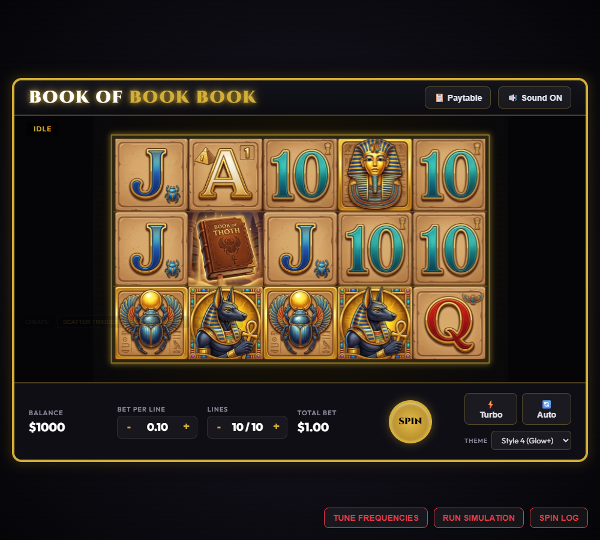
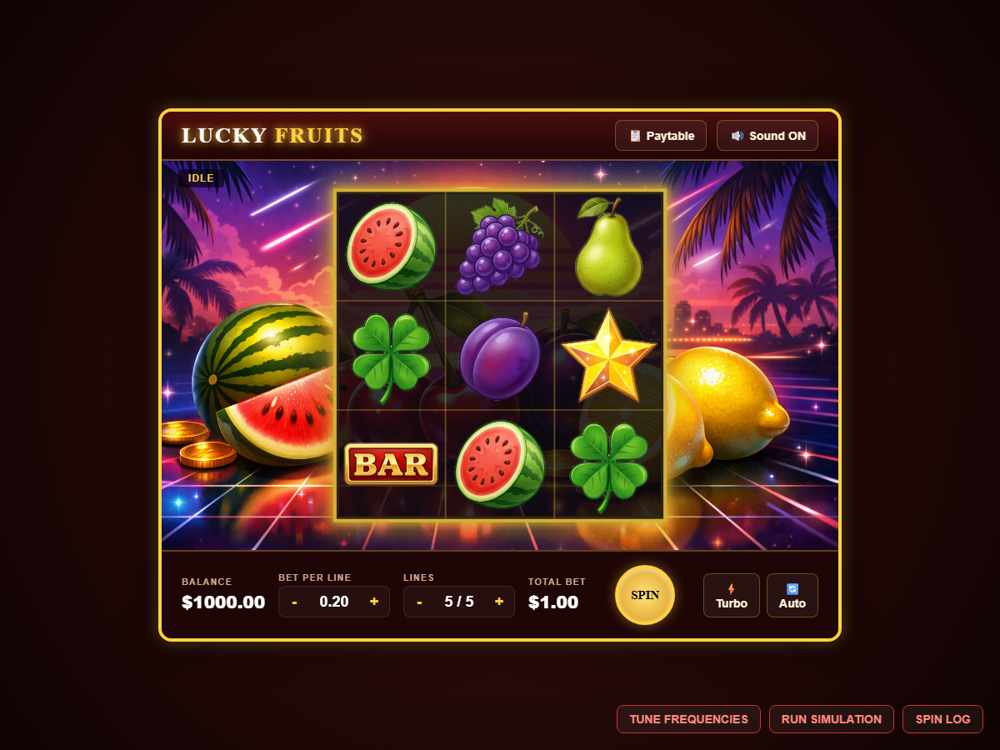
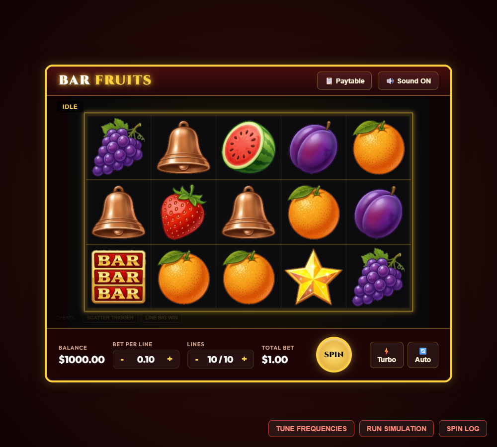
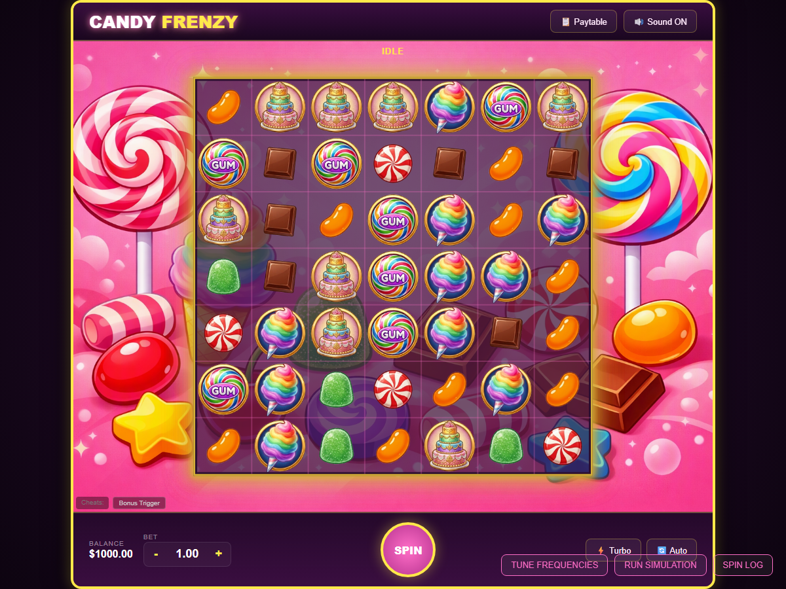
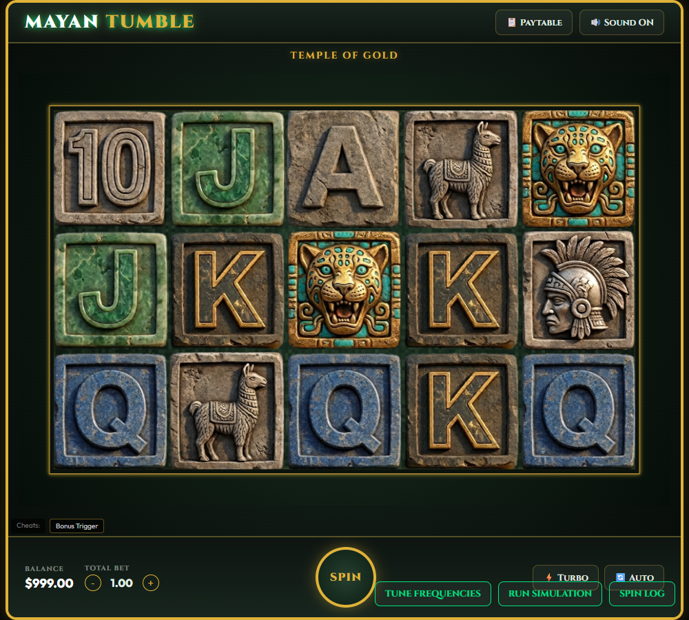

# Slot Master



Browser-based slot machine games. Plain ES modules, no build step, no bundler —
open `index.html` (via a local server, see below) and play.

## Games

| Game | Screenshot | Grid | Bonus | README |
|---|---|---|---|---|
| Book of Book Book |  | 5x3, 10 lines | Book scatter → free spins with an expanding symbol | [games/bookbookbook](games/bookbookbook/README.md) |
| Lucky Fruits |  | 3x3, 1-5 lines | None — wilds only | [games/fruitmachine](games/fruitmachine/README.md) |
| Bar Fruits |  | 5x3, 10 lines | Star scatter → free spins, no expanding symbol | [games/barfruits](games/barfruits/README.md) |
| Candy Frenzy |  | 7x7, cluster pays (min. 5, no paylines) | Bonus scatter → free spins with growing multiplier tiles, cascading wins | [games/candyfrenzy](games/candyfrenzy/README.md) |
| Mayan Tumble |  | 5x3, 10 lines, cascading | Gold scatter → free spins with growing multiplier tiles, cascading wins | [games/mayantumble](games/mayantumble/README.md) |

All five games run on the same `core/engine/CoreSlotEngine.js` skeleton, debug tooling (SPIN LOG,
RUN SIMULATION, TUNE FREQUENCIES), and simulator (`core/SpinSimulator.js`) - which spin/win logic
actually runs is pluggable per game via a **mechanic** component, `core/engine/mechanics/
LineMechanic.js` (the first three) or `core/engine/mechanics/CascadeSpinMechanic.js` (the two
cascade games: `core/math/CascadeMath.js` + `core/engine/FreeSpinsModes.js` for its pluggable
free-spins payout modes) - see `docs/ARCHITECTURE.md`'s "pluggable gameplay mechanics" section
for how they share one architecture instead of two. Each README covers only what's specific to
that game.

The two cascade games are the same engine and mechanic with different win evaluators, which is
the point of the split: Candy Frenzy supplies `core/math/ClusterMath.js`'s cluster evaluator,
Mayan Tumble supplies its own that maps `core/math/SlotMath.js`'s payline wins into the same
shape. Nothing in `CoreSlotEngine`/`CascadeSpinMechanic` knows which it got.

## Running it

ES modules need to be served over HTTP (`file://` won't work). On Windows:

```powershell
./serve.ps1
```

This starts a static server (`npx serve`) on a random free port and prints the
URL to open.

### Publishing on GitHub Pages

The repository includes a manual-only workflow at `.github/workflows/deploy-pages.yml`.
To publish the games, enable **Settings → Pages → Source: GitHub Actions**, then open
the **Actions** tab, select **Deploy to GitHub Pages**, and choose **Run workflow**.
The deployed site URL is shown on the completed workflow run.

## Running the tests

```bash
npm test
```

Runs every `tests/*.mjs` file under Node's built-in test runner. No browser
required — the math/simulation modules are plain functions, tested directly.

## Architecture

See [docs/ARCHITECTURE.md](docs/ARCHITECTURE.md) for the `core/` module API reference and how
a new game hooks into it.

## Project layout

```
core/    Shared engine code, used by every game
games/   One folder per game (game.js, index.html, game.css)
tests/   node --test suite for core/
docs/    Design specs and implementation plans (docs/superpowers/)
```

Release notes live in [CHANGELOG.md](CHANGELOG.md).

- **`core/engine/CoreSlotEngine.js`** — the live game: a skeleton owning only the state machine
  and animation loop. Everything else - grid resolution, animation style, drawing, particles,
  audio, free-spins payout rules, spin logging - is a separate component class plugged in through
  its config. See `docs/ARCHITECTURE.md` for the full component list.
- **`core/math/SlotMath.js`** — pure math: building reel strips (`generateReel`), evaluating
  spins (`checkWildLineWins`, `checkWins`).
- **`core/math/CascadeMath.js`** / **`core/math/ClusterMath.js`** — the cascade games' pure math:
  generic cascade/gravity mechanics (`resolveCascadeSequence`) and Candy Frenzy's own cluster win
  evaluator. Knows nothing about clusters or paylines itself: the win evaluator is a closure the
  game supplies (`ClusterMath.js`'s for Candy Frenzy, a payline one for Mayan Tumble), and the
  playfield's own look is a per-game `playfield` config passed to `CoreSlotEngine`.
- **`core/SpinSimulator.js`** — runs many simulated spins to measure RTP/trigger rate, and
  `tuneFrequencies`, which automatically adjusts a game's reel frequencies to hit a target RTP.
- **`core/SimulationPanel.js`** — the in-browser RUN SIMULATION / TUNE FREQUENCIES UI (a debug
  panel included in each game's `index.html`), plus the formatter that turns a tuned result
  back into pasteable `FREQUENCY_REELn` source.
- **Tuner support modules**, all pure and separately tested — `core/TuningValidation.js` (static
  config checks that refuse to tune on arithmetic errors), `core/TuningUnits.js` (converting
  between what a developer asks for and what the search optimizes: spins-per-trigger ↔ percent,
  volatility bands ↔ sigma, intent ↔ penalty weight), `core/StructuralSensitivity.js` and
  `core/StructuralSearch.js` (which structural knob actually moves RTP, and what to set it to),
  `core/PlayerExperience.js` (what a tuned result feels like to play), and `core/TuneLog.js`
  (every config that became the best, exportable as JSON or as pasteable source).
- **`core/SimulationWorkerPool.js`** / **`core/simulationTrialWorker.js`** /
  **`core/mechanicRegistry.js`** — the Worker pool tuning trials are dispatched to, one trial per
  message, and the registry that resolves a mechanic/evaluator/free-spins-mode back from the name
  it crossed `postMessage` as (a function cannot cross directly).
- **`core/SpinLog.js`** — pure per-spin log entry building and CSV serialization, shared by
  both `SpinSimulator.js` (a batch run) and `core/engine/SpinLogRecorder.js` (live play, plugged
  into `CoreSlotEngine`) so the two can't drift apart on what a logged spin looks like. See
  "Spin logging" below.
- **`core/SpinLogPanel.js`** / **`core/FileIO.js`** — the in-browser SPIN LOG viewer (reads
  `engine.spinLog`) and a small generic "download this text as a file" helper it uses for
  CSV export.
- **`core/audio/SlotAudio.js`** — synthesized sound effects, played via `core/engine/
  AudioController.js` (another pluggable `CoreSlotEngine` component).

Each game (`games/<name>/game.js`) owns its own `PAYTABLE`, paylines, and per-reel frequency
tables, and wires them into the shared `core/` modules. See each game's own README for its
specific mechanics.

## Reel frequency tables

Every game defines one frequency table per reel (`FREQUENCY_REEL1`, `FREQUENCY_REEL2`, ...),
passed to `generateReel` (`core/math/SlotMath.js`) to build that reel's physical strip. All tables
share one shape:

```js
export const FREQUENCY_REEL1 = {
  defaults: { minGap: 2 },       // optional reel-wide fallback constraints
  symbols: {
    bar: { frequency: 24.5 },
    star: { frequency: 6.3, minFrequency: 2, maxFrequency: 6, maxStack: 1, minGap: 3 },
  },
};
```

`frequency` is the only required field — everything else is optional and defaults to "no
constraint." A table with no `.symbols` key (a bare `{ symbol: { frequency } }` map) is also
accepted as a legacy flat shape; it just can't express reel-level `defaults`.

**`minGap`** — minimum circular distance enforced between two occurrences of the *same*
symbol on the built strip (self-spacing only, not relative to other symbols). Resolved as:
per-symbol `minGap` → this reel's `defaults.minGap` → built-in fallback. The built-in fallback
is `1` (unconstrained) for a normal symbol, but `3` for any symbol with
`PAYTABLE[symbol].triggerFreeSpins === true` (the free-spins scatter) — so a scatter symbol
gets sensible spacing automatically, without a game needing to configure it. That `3` is
itself just `generateReel`'s `defaultTriggerMinGap` parameter, overridable per call.

**`maxStack`** — maximum run length of consecutive identical occurrences of that symbol
allowed on the built strip (also circular — a run can wrap from the end of the strip back to
the start). Resolved the same way: per-symbol `maxStack` → this reel's `defaults.maxStack` →
built-in fallback of `Infinity` (unconstrained). There's no free-spins-aware default for this
one — a game opts in explicitly per symbol or per reel.

**`minStack`** — opts a symbol into clustering: instead of appearing as isolated single stops,
its occurrences are grouped into runs at least `minStack` long (capped by `maxStack`, if set).
Resolved per-symbol `minStack` → this reel's `defaults.minStack` → built-in fallback of `1`
(unclustered — every reel that doesn't opt in behaves exactly as before this field existed).

**`stackChance`** — only meaningful when `minStack > 1`: the probability (`0`–`1`) that a given
occurrence starts an actual stack (a run randomly sized between `minStack` and `maxStack`)
rather than landing as a lone single. Resolved the same way, with a built-in fallback of `1`
("always stack" — every occurrence clusters, the original `minStack` behavior). At `0`, a
`minStack`-configured symbol never clusters at all; anywhere in between mixes lone singles and
valid `minStack`–`maxStack` stacks, never a run outside those two shapes.

Both `minGap`/`maxStack` are best-effort: if a reel is too dense to fully satisfy one (e.g. asking
for `minGap: 10` when a symbol appears 50 times on a 100-long strip), `generateReel` gets as close
as it can rather than throwing or looping forever.

**`fixed: true`** on a symbol excludes it from `tuneFrequencies`' automatic search on that
reel — its frequency is left exactly as written. Used for symbols whose frequency shouldn't be
touched by auto-tuning (e.g. a wild that's deliberately rare).

**`minFrequency`/`maxFrequency`** on a symbol are soft bounds `tuneFrequencies` tries to keep
that symbol's tuned frequency within, on that reel — a discouraged-but-not-forbidden
preference, not a hard clamp. Resolved the same per-symbol → reel `defaults` → unconstrained
way as `minGap`/`maxStack` (see `resolveFrequencyBounds` in `core/math/SlotMath.js`).

### `triggerFreeSpins`, not `type: 'scatter'`

Whether a symbol triggers free spins is read from `PAYTABLE[symbol].triggerFreeSpins === true`
— not from `PAYTABLE[symbol].type`. This is what drives both the `minGap` default above and
`tuneFrequencies`' free-spins-trigger-rate tuning phase. `type: 'scatter'` still exists as a
paytable field, but it's now only about win evaluation (see `paymode` below) — a symbol can be
`triggerFreeSpins: true` without being `type: 'scatter'`, or vice versa.

### `paymode` default

A paytable symbol's `paymode` controls whether it pays per active payline (`'line'`) or
independent of lines (`'any'`, e.g. scatter pays). If omitted, it defaults to `'any'` for a
symbol with `type: 'scatter'`, and `'line'` for everything else — so most symbols never need
to write it explicitly, only a symbol that wants to override that default.

### Tuning: `orderingBiasByReel`

`tuneFrequencies` (`core/SpinSimulator.js`) always defaults to `-1` for every reel unless
`orderingBiasByReel` is passed explicitly — i.e. "a higher-paying symbol should not be more
frequent than a lower-paying one," same as before this option existed. The TUNE FREQUENCIES
panel (`core/SimulationPanel.js`) pre-selects a different value per reel in its UI dropdowns
only (early reels default to `1`, middle reels to `-1`, late reels to `0`) as a starting point
for a "near miss" feel — premium symbols showing up often on the reels a player sees land, but
rarely on the ones that would complete the line. That's a UI convenience, not a change to
`tuneFrequencies`' own default; calling it directly without `orderingBiasByReel` still behaves
exactly as before.

`tuneFrequencies` has several more tuning knobs (`uniformityPenaltyWeight`,
`initialWeightStrategy`, per-reel ordering `Strength`, ...) — its own JSDoc in
`core/SpinSimulator.js` is the canonical reference for all of them, deliberately not duplicated
here.

### Tuning: penalty weights are normalized

Penalty weights mean the same thing on every game. Raw penalty totals are incommensurable —
ordering is measured in frequency units, spacing as a violation *count* — and summing those with
an RTP error in percentage points makes a weight's meaning depend on the game it is applied to.
Under `penaltyNormalization: 'normalized'` (the panel's default) each penalty is re-expressed as
a scale-free fraction, so **weight 1 ≈ 1pp of RTP** and the same weights transfer between games.
The panel names them by intent ("Insist", "Prefer") rather than by magnitude for the same reason.

Typing a raw weight into any of those controls switches the whole run back to `'raw'`, on purpose:
the named levels are calibrated against normalized penalties, so reinterpreting a hand-written
number in a denomination its author did not choose would silently change what they asked for.
A game whose `tuneConfig` sets a weight the named levels don't offer (Mayan Tumble's
`triggerRatePenaltyWeight: 0.1`) therefore opens the panel in raw mode.

### Structural knobs move RTP more than frequencies do

On a cluster-cascade game `stackChance`/`maxStack`/`minStack` move RTP by one to two orders of
magnitude more than the entire per-symbol frequency search can. Tuning frequencies against a
structure that cannot reach the target is the expensive way to discover that, so the tuner's
**CHECK MY CONFIG** action measures the structure first — see `core/StructuralSensitivity.js`
(rank the knobs by leverage) and `core/StructuralSearch.js` (sweep them jointly, and refuse to
name a winner when the measurement noise floor is wider than the tolerance).

## Spin logging

Every real spin (base and free, live in the browser) is recorded to `engine.spinLog` — one
entry per spin, each with its own seed, timestamp, bet, and a breakdown of every
scatter/line/expanding win it produced (`core/SpinLog.js`'s `createSpinLogEntry`). Click a
game's **SPIN LOG** button to open a live-refreshing table of recent spins with an **EXPORT
CSV** button (`core/SpinLogPanel.js`), for pulling a session's data into Excel/Sheets.

RUN SIMULATION can log the same way: pass `logSpins: true` to `simulateSpins`/
`engine.runSimulation` and every simulated spin lands in `results.spinLog` too — the RUN
SIMULATION panel does this automatically, seeding each run (shown next to its results) so it
can be reproduced, with its own "EXPORT SPIN LOG (CSV)" button. Both paths share the same
`core/SpinLog.js` entry shape and CSV format (`exportSpinLogCsv`), so a batch run's export and
a live session's export are interchangeable in a spreadsheet. The win-breakdown cell uses a
compact, regex-friendly format — `TYPE:symbol:count:amount[:flags]` per win, joined by `|`
(e.g. `S:book:3:20|L4:ace:3:5:W`) — see `summarizeSpinWins`'s own doc in `core/SpinLog.js` for
the exact grammar.

## License

Copyright © 2026 Kim Forsberg. All rights reserved. Non-commercial use, modification, and
redistribution are permitted with attribution and share-alike (same terms passed on to any
derivative). Commercial use requires the copyright holder's prior express written consent.
Provided with no warranty of any kind and not suitable for commercial or real-money use. See
[LICENSE.md](LICENSE.md) for the full terms.

Portions of this project (code, docs, and image assets) were developed with the assistance
of AI tools, including Claude Code, GitHub Copilot, and Google Gemini image generation.

---
_Docs last synced with the codebase: 2026-07-28, commit `4ed60a2`._
