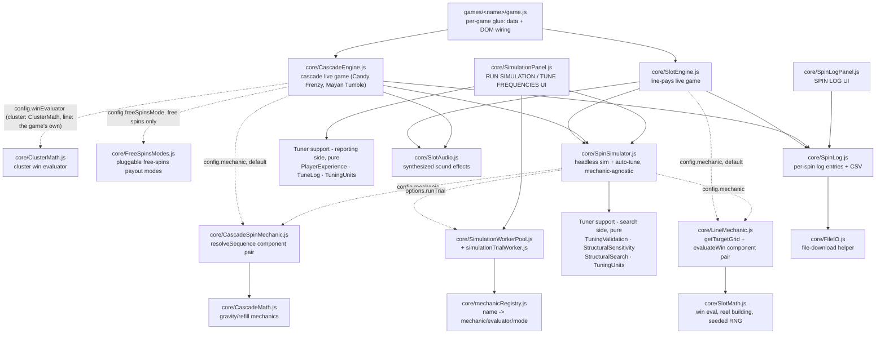
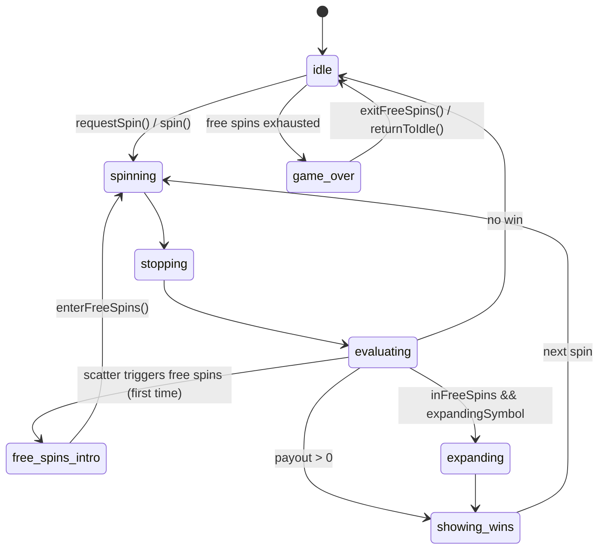
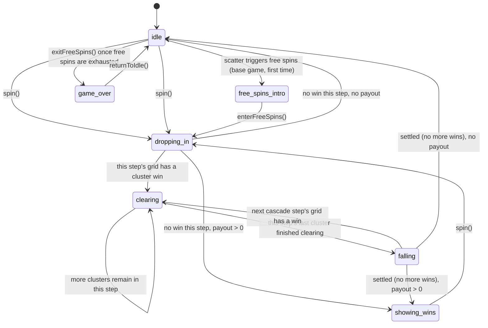
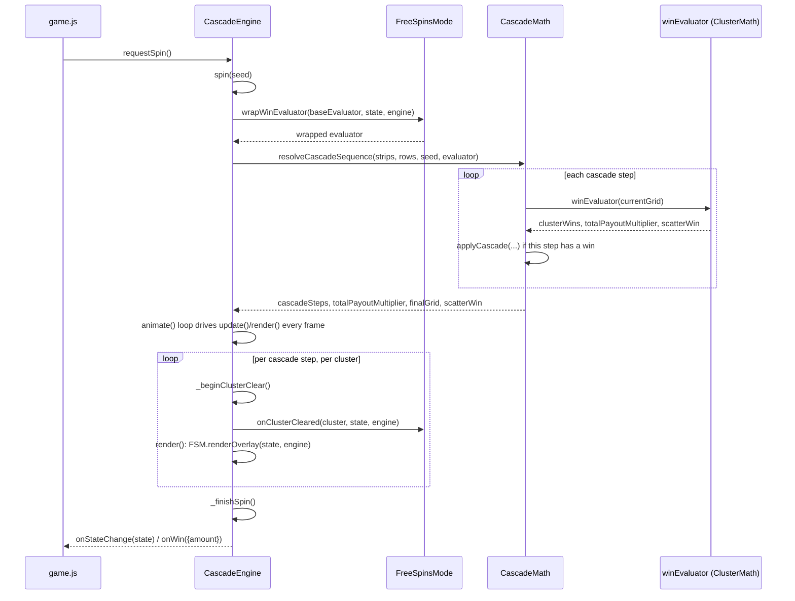

# Architecture

How `core/` is put together, the API each module exposes, and how a game in `games/<name>/`
plugs into it. See the top-level [README](../README.md) for how to run things and for the
reel-frequency-table data model specifically.

## Layering

Nothing in `core/` imports from `games/`. A game only ever flows data *into* `core/` (its own
paytable, paylines, reel strips, DOM element references) — `core/` never hardcodes a symbol
name, payout shape, or grid size. This is what lets `SlotMath.js` and `SpinSimulator.js` run
identically inside the live browser game, inside the in-browser debug tools, and inside
`node --test` with no DOM at all.

**Gameplay mechanics** (`LineMechanic.js`/`CascadeSpinMechanic.js`) are the one layer both
engine families and the simulator share: each mechanic is a plain object exposing "get the
symbols for the playfield" (`getTargetGrid`/`resolveSequence`) and "calculate wins"
(`evaluateWin`/the wrapped `winEvaluator`) as named methods, plus a `resolveSpin` entry point
composed from those same methods for batch simulation. `SlotEngine.js`/`CascadeEngine.js` call
the component methods directly for live, animated play; `SpinSimulator.js` calls `resolveSpin`
for a synchronous batch run — same components, same results, no duplicated win logic between
live play and simulation. `config.mechanic` defaults to `LineMechanic`/`CascadeSpinMechanic`
respectively, so no existing game had to change anything to keep working.

Mayan Tumble is what tested that claim. It is a *line-pay cascade* — `CascadeSpinMechanic`
unmodified, with a win evaluator that runs `SlotMath.js`'s `checkWins` and maps its `lineWins`
into the `clusterWins` shape `resolveCascadeSequence` expects. No engine or mechanic change was
needed, which is the design working. What did need changing was everything that had quietly
started using "cascade" and "cluster" as the same word: `CascadeEngine` had no way to draw *which
line* paid (see `_renderWinLine`), and its playfield colours were Candy Frenzy's hardcoded (see
`config.playfield`). Both are now per-game, defaulting to the previous behaviour.

## `core/SlotMath.js` — pure math, no side effects

Every export is a pure function: same inputs always produce the same output, nothing touches
the DOM, nothing holds state between calls. This is deliberate — it's what makes the module
usable from all three contexts above (game engine, simulator, tests) without adapters.

- **`checkWins(grid, paytable, paylines, activeLinesCount, wildSymbol, scatterSymbol,
  scatterTriggerCount)`** — the default win evaluator (`SlotEngine`'s `winEvaluator` default).
  Evaluates left-to-right line matches (with generic wild substitution via `wildSymbol`) and,
  separately, scatter wins (any symbol equal to `scatterSymbol`, anywhere on the grid, count
  ≥ `scatterTriggerCount`). Returns `{ lineWins, scatterWin, totalLinePayoutMultiplier,
  totalScatterPayoutMultiplier }`. `scatterWin.triggerFreeSpins` is set once enough scatters
  land, regardless of whether a payout is defined for that count.
- **`checkWildLineWins(grid, paytable, paylines, activeLinesCount)`** — an alternate line-win
  evaluator for wilds that only ever substitute in the *last* grid position of a line (e.g. a
  classic 3-reel fruit machine's reel-3 wild). Reads `wild`, `wildOnly`/`wildExcludes`,
  `wildPenalty`, and `aloneBonus` directly off each paytable entry — nothing hardcoded, so it's
  reusable by any game with this specific wild shape. Has no scatter handling at all.
- **`checkExpandingWins(grid, expandingSymbol, paytable, paylines, activeLinesCount,
  expandingPaytable)`** — Book-of-Dead-style expanding-symbol evaluator, called by
  `SlotEngine` itself (not chosen via `winEvaluator`) whenever `engine.inFreeSpins &&
  engine.expandingSymbol` is set after the normal win evaluation. Any reel containing the
  symbol counts as fully covered by it on every active payline.
- **`generateReel(reelWeights, targetLength, seed, exclude, defaultTriggerMinGap, paytable)`**
  — builds one weighted, seeded reel strip from a frequency table, with optional per-symbol
  `minGap`/`maxStack` spacing constraints. See the top-level README's "Reel frequency tables"
  section for the full shape and default-resolution rules.
- **`createSeededRng(seed)`** — deterministic PRNG (mulberry32); returns a `() => number`
  function yielding the same float sequence for a given seed every time. This is the seedable
  RNG threaded through everywhere an outcome needs to be reproducible: a live spin
  (`SlotEngine.spin(seed)`, so `engine.spin(engine.lastSpinSeed)` replays exactly), reel
  building, and the tuner's common-random-numbers search.
- **`generateTargetGrid(reelStrips, rowsCount, rng)`** — picks one random stop position per
  reel strip and reads off the visible window; this is what a spin outcome *is*, independent
  of animation. `SlotEngine.spin()` calls this once per spin with a fresh (or replayed) seeded
  rng to get `this.targetGrid`, which every reel's landing animation then just visually
  catches up to.

## `core/CascadeMath.js` / `core/ClusterMath.js` — cascade pure math

Same "pure function, no side effects" rule as `SlotMath.js` above - the cascade games' equivalent
of that module, split in two: generic cascade mechanics (`CascadeMath.js`, knows nothing about
clusters or paylines) and Candy Frenzy's own win evaluator (`ClusterMath.js`). Mayan Tumble
supplies its own evaluator instead, in its `game.js`, and touches neither of these differently.

- **`nextStripSymbol(strip, cursorState)`** (`CascadeMath.js`) — reads the symbol at
  `cursorState.index`, advances the cursor by 1 (wrapping circularly), and never re-rolls -
  the one rule every cell dropping into the grid follows, whether that's the very first fill
  or a later cascade refill.
- **`applyCascade(grid, cursorStateByColumn, strips, clearedPositions)`** (`CascadeMath.js`) —
  removes the given positions, compacts each column's survivors downward (gravity), and
  refills the vacated top cells by reading forward from that column's own cursor. Returns
  `{ grid, fallOffsets }`, where `fallOffsets[col][row]` is that cell's fall distance in rows
  for animating the transition (a whole freshly-spawned group in one column shares the same
  offset, so it forms one contiguous block sitting just above the grid, never partway inside
  it). Also used for a spin's very first fill: call it with an all-null grid and every
  position listed as cleared.
- **`checkScatterCount(grid, scatterSymbol, triggerCount)`** (`CascadeMath.js`) — counts a
  symbol anywhere on the grid, independent of win type; a scatter check runs the same way
  whether the game underneath is cluster-pays or a future payline-cascade game.
- **`resolveCascadeSequence(strips, rowsCount, seed, winEvaluator, maxCascadeSteps=1000)`**
  (`CascadeMath.js`) — the "what happens" half of one entire spin: resolves the initial fill,
  then every cascade step, synchronously and deterministically, until a step produces no win.
  Returns `{ cascadeSteps, totalPayoutMultiplier, finalGrid, scatterWin }`, where each
  `cascadeSteps[i]` carries that step's `grid`/`fallOffsets`/`clusterWins`/`payout`. This
  mirrors `SlotEngine`'s own precompute-then-animate pattern (`generateTargetGrid` then a
  reel's landing tween) - `CascadeEngine`'s job is only to animate playback of an
  already-fully-resolved sequence, never to decide it live frame-by-frame.
- **`checkClusterWins(grid, paytable, minClusterSize, scatterSymbol, scatterTriggerCount)`**
  (`ClusterMath.js`) — Candy Frenzy's win evaluator: orthogonal flood-fill clustering (up/down/
  left/right, not diagonal) plus a cluster-size payout lookup off each symbol's
  `paytable[symbol].clusterPayout` (an array of `{ min, multiplier }` breakpoints - a cluster
  can run all the way up to the full grid, not a small fixed line-length like a payline game's
  `payout[i]` array). Returns `{ clusterWins, totalPayoutMultiplier, scatterWin }`, the exact
  shape `resolveCascadeSequence`'s `winEvaluator` parameter expects - a cascade game with a
  different win rule supplies its own evaluator with this same shape instead, unchanged
  elsewhere. Mayan Tumble's `checkLineCascadeWins` is exactly that: `checkWins`' `lineWins`
  mapped into `clusterWins`, each payout divided by the line count so it stays relative to the
  total bet, and each carrying the `lineIndex` it was paid on.

## `core/SlotEngine.js` — the live game: state machine + canvas renderer

A class, one instance per running game (`new SlotEngine(canvas, config)`). Owns balance,
bet, reel physics/animation, and win presentation; delegates all win logic to whichever
`winEvaluator` function the config supplies.

**Construction config** (all optional except `reelStrips`, which must have one entry per
`reelsCount`):

| Field | Default | Purpose |
|---|---|---|
| `reelsCount`, `rowsCount` | `5`, `3` | Grid shape |
| `paytable` | `{}` | Passed straight through to `winEvaluator` |
| `reelStrips` | `[]` | One strip per reel, from `generateReel` |
| `paylines` | *(required, no default)* | One row-index-per-reel array per line |
| `wildSymbol`, `scatterSymbol` | `null` | Passed positionally to `winEvaluator` — only meaningful to evaluators that read them (`checkWins` does; `checkWildLineWins` ignores them, reading wild rules off `paytable` instead) |
| `winEvaluator` | `checkWins` | `(grid, paytable, paylines, activeLinesCount, wildSymbol, scatterSymbol) => results` |
| `betPerLine`, `linesCount` | `1`, `10` | Starting bet |
| `symbolsConfig`, `spritesheetUrl` | — | Sprite atlas: `{ [symbolName]: {x,y,w,h} }` + image URL |
| `onStateChange(state)` | no-op | Fired on every state transition (see State machine below) |
| `onScatterTrigger(scatterCount, isInFreeSpins)` | no-op | Fired instead of auto-advancing when `scatterWin.triggerFreeSpins` — the game decides what a trigger/retrigger means |
| `onWin({amount, isExpanding})` | no-op | Fired whenever a spin pays out |

**State machine** (`engine.state`, reported via `onStateChange`): `idle` → `spinning` →
`stopping` → `evaluating` → (`free_spins_intro` | `expanding` | `showing_wins` | `idle`) →
... → `game_over` (free spins summary). Every transition is an explicit assignment inside
`SlotEngine`, not inferred from animation progress — e.g. a reel's landing tween is scheduled
to finish at a precomputed timestamp (`landStartTime`), so "did it land" is never a question
answered by polling physics.

**Public methods a game calls:**
- `requestSpin()` — the one entry point for a UI's spin/stop button; safe to call in any
  state (queues itself if the engine is mid-animation, e.g. during an expansion).
- `spin(seed?)` / `stopSpin()` — start a spin (optionally replaying a specific seed) / cut the
  current spin short.
- `forceWinResult('scatter' | 'expanding' | 'bigwin')` — debug/cheat helper; forces the next
  spin's grid to contain a given outcome (see each game's README for its cheat buttons).
- `enterFreeSpinsIntro()` / `enterFreeSpins(spinsCount, expandingSymbol)` /
  `retriggerFreeSpins(spinsCount)` / `returnToIdle()` / `exitFreeSpins()` — free-spins
  lifecycle, entirely game-driven (see "Adding free spins" below) — `SlotEngine` never enters
  or exits free spins on its own.
- `updateBet()` — recompute `totalBet` after changing `betPerLine`/`linesCount`.
- `loadAssets(spritesheetUrl?, symbolsConfig?)` — (re)load the sprite atlas, e.g. for a theme
  switcher.
- `runSimulation(numBaseSpins?, betPerLine?, linesCount?, options?)` — thin wrapper around
  `SpinSimulator.simulateSpins` using this engine's own live `config`, so a simulation always
  measures exactly what the running game would actually pay. `options.seed` seeds the run for
  reproducibility; `options.logSpins` (default `false`) populates the returned `spinLog` (see
  "Spin logging" below) — both off by default, matching `simulateSpins`' own legacy behavior.

Also exposes `engine.spinLog` (one entry per real spin made so far, see "Spin logging" below)
and `engine.lastSpinSeed` (the seed behind the most recent spin — `engine.spin(engine.
lastSpinSeed)` replays it exactly) as plain properties a game or debug tool can read directly;
neither needs a method call.

Rendering (`render()` and everything below it) is internal — a game never calls into it
directly, only supplies the sprite atlas and reacts to `onStateChange`/`onWin` to update its
own DOM (balance display, spin button label, etc.).

## `core/CascadeEngine.js` — the cascade live game

`SlotEngine.js`'s sibling for cascade games (Candy Frenzy's cluster-pays and Mayan Tumble's
line-pays, with nothing in the class specific to either) - same "one class instance, owns
balance/bet/animation, delegates win logic to config" shape, built around `resolveCascadeSequence`
(`CascadeMath.js`) instead of `generateTargetGrid`. `config.winEvaluator` here is a
single-argument closure the game supplies (e.g. `(grid) => checkClusterWins(grid, PAYTABLE, 5,
'bonus', 3)`) - `CascadeEngine` itself knows nothing about clusters or paylines, only about
grids, cascades, and free spins.

**Construction config** (all optional except `reelStrips`, `paytable`, `winEvaluator`):

| Field | Default | Purpose |
|---|---|---|
| `reelsCount`, `rowsCount` | `7`, `7` | Grid shape |
| `paytable`, `reelStrips` | `{}`, `[]` | Passed straight through to `winEvaluator` / `resolveCascadeSequence` |
| `winEvaluator` | no-op (no wins) | `(grid) => { clusterWins, totalPayoutMultiplier, scatterWin }` |
| `scatterSymbol` | `null` | Which symbol name triggers free spins |
| `paylines` | `null` | Line-pay cascade games only. Purely presentational here: the engine draws the path of whichever win is being paid, for any win carrying a `lineIndex` (see below) |
| `playfield` | Candy Frenzy's palette | How the playfield itself is drawn - see below |
| `freeSpinsMode` | `createFlatMultiplierMode()` | Pluggable free-spins payout mode - see `core/FreeSpinsModes.js` below |
| `betAmount` | `1` | This game's single flat bet (no bet-per-line/lines concept) |
| `symbolsConfig`, `spritesheetUrl` | — | Sprite atlas, same shape as `SlotEngine`'s |
| `onStateChange(state)` | no-op | Fired on every state transition |
| `onScatterTrigger(scatterCount, isInFreeSpins)` | no-op | Fired instead of auto-advancing when the resolved spin's `scatterWin.triggerFreeSpins` is set |
| `onWin({amount})` | no-op | Fired whenever a spin pays out |

**Payline indicators.** A cascade win is normally just a set of cells, which is the whole story
for a cluster. It is not for a line-pay cascade: three matching symbols on a 5×3 grid sit on
several paylines at once, the payout differs per line, and the highlighted cells cannot say which
line paid. So a win may carry a **`lineIndex`**, and `_renderWinLine` draws that payline's path
across the grid with its 1-based number at both ends, for the win currently being cleared - one at
a time, matching how the engine already sequences glow, particles, popup and ding. A cluster win
carries no `lineIndex` and a cluster game passes no `paylines`, so the whole feature is a no-op
for Candy Frenzy. The stroke runs from one numbered tag's centre to the other: the tags are where
a line begins and ends, not decorations beside it.

**Playfield theming.** Everything behind and around the symbols - backdrop gradient, outline and
its glow radius, inner frame, grid lines, loading screen - comes from `config.playfield`, merged
over defaults that *are* the Candy Frenzy look, so a game passing nothing is unchanged. Two fields
are choices rather than colours:

- **`gridLines`** (a colour, or `null` to omit them). A cluster game wants its cells ruled,
  because a cluster *is* a set of cells and the ruling is what makes its shape legible. A payline
  win is a path across the grid, and ruling it anyway makes the playfield look like a spreadsheet
  with art in it.
- **`noise`** (`{ color, strength, scale, seed }`, or `null`) — a fixed grain across the playfield,
  texture where the ruling used to be. Generated once into an offscreen canvas and blitted, never
  regenerated per frame: a crawling backdrop reads as a rendering fault rather than as texture.
  Seeded, so it is identical on every load. Rebuilt only when the grid is resized.

**State machine** (`engine.state`): `idle` → `dropping_in` → (`clearing` → `falling`)* →
`showing_wins` → `idle`, plus `free_spins_intro`/`game_over` (free-spins lifecycle, same
naming convention as `SlotEngine.state`).

Each reel/column animates independently rather than behind one global barrier: a column's own
leftover grid exits, then that same column's new symbols enter immediately
(`columnOutgoingDone`/`columnEnterStartTime`), staggered left-to-right on an ease-out curve
(`_columnStartDelay`) so it reads as a wave rather than a
uniform drop. Within one spin, multiple cascade steps' clusters animate one at a time
(`currentClusterWins`/`currentClusterIndex`/`_beginClusterClear`), each with its own glow,
per-symbol vanish variant, particles, floating win popup, and ding - not all bursting at once.

**Public methods a game calls:**
- `requestSpin()` / `spin(seed?)` — same shape as `SlotEngine`'s; `spin()` also handles the
  every-spin "leftover grid falls out, new grid falls in" animation and (on the very first
  call) the decorative non-winning initial fill (`_fillInitialGrid`, called once from `init()`
  so the grid is never blank on load).
- `forceScatterResult()` — debug/cheat helper; forces the next spin's final grid to contain 3
  of `config.scatterSymbol`, for testing the free-spins trigger without waiting for a natural
  hit.
- `enterFreeSpinsIntro()` / `enterFreeSpins(spinsCount)` / `retriggerFreeSpins(spinsCount)` /
  `returnToIdle()` / `exitFreeSpins()` — free-spins lifecycle, entirely game-driven, same
  division of responsibility as `SlotEngine`'s (see "Optional: free spins" below - the cascade
  version follows the same pattern). `enterFreeSpins`/`exitFreeSpins` also rebuild the active
  `freeSpinsMode`'s state fresh (see `core/FreeSpinsModes.js`), so a mode's own per-tile
  tracking never leaks between bonus rounds or into the base game.
- `handleAutoPlay()` — schedules the next spin (base-game autoplay or the free-spins loop)
  after the current one settles.

Also exposes `engine.spinLog`/`engine.lastSpinSeed` as plain properties, same as `SlotEngine`.
- `runSimulation(numBaseSpins, betAmount?, linesCount?, options?)` — same shape as
  `SlotEngine.runSimulation` (so `SimulationPanel.js` can call either engine identically);
  `linesCount` exists only for that parity and is always forced to 1 internally. Delegates to
  `SpinSimulator.js`'s `simulateSpins` with `config.mechanic` (`CascadeSpinMechanic`) and this
  instance's own `freeSpinsMode`, so a simulated free-spins round measures the real carried-over
  economics (e.g. Candy Frenzy's persistent multiplier tiles), not a flat approximation. Candy
  Frenzy's own RUN SIMULATION/TUNE FREQUENCIES buttons use this (see its README).

One spin, end to end - resolving the whole outcome synchronously, then animating playback of
it (`freeSpinsMode` only enters the picture while `inFreeSpins`):

## `core/FreeSpinsModes.js` — pluggable free-spins payout modes

How `CascadeEngine` varies what a free-spins win pays, without hardcoding any one rule into
the engine itself: `config.freeSpinsMode` is a plain object of lifecycle hooks the engine
calls without knowing which concrete mode is active, only ever consulted while
`engine.inFreeSpins` (the base game always uses `winEvaluator` completely unwrapped). A future
mode - for Candy Frenzy or a future cascade game - just needs to implement this same shape, no
`CascadeEngine` changes required.

- **`createState(engine) -> any`** — builds the mode's own working state. Called once when
  free spins begin (`enterFreeSpins`) and again the instant they end (`exitFreeSpins`), so
  persistent per-tile state (like multiplier tiles) always starts fresh at the top of a bonus
  round and is fully cleared the moment it's over.
- **`wrapWinEvaluator(baseEvaluator, state, engine) -> (grid) => results`** — wraps the game's
  win evaluator so every cluster's payout (and the step's `totalPayoutMultiplier`) already
  reflects this mode's bonus by the time `resolveCascadeSequence` finishes resolving the whole
  spin, synchronously, one call per cascade step, in chronological order. `CascadeEngine`'s own
  money code (`_finishSpin`/`_spawnClusterWinPopups`/spin log) trusts these numbers as-is and
  never applies anything else on top.
- **`onClusterCleared(cluster, state, engine)`** — called once per cluster, only while
  `inFreeSpins`, at the exact moment `_beginClusterClear` starts playing that cluster's own
  clear animation - a mode with visible per-tile state updates it here, in step with the
  animation, not all at once back when the whole spin was precomputed.
- **`renderOverlay(state, engine)`** — called once per frame from `render()`, every frame
  regardless of `inFreeSpins` (a mode's state is reset to "nothing to show" the instant free
  spins end, so this is naturally a no-op outside a bonus round). Whether it draws before or
  after the grid's own symbols that frame is controlled by the mode object's own
  **`renderOverlayOrder`** property (`'behind'` or `'front'`, default `'front'` if omitted) -
  candy sprite art is essentially opaque, so a `'behind'` overlay is only ever visible on a
  cell with no symbol drawn over it yet; `'front'` stays legible on a landed tile too. Each
  mode picks whichever fits its own visual.

Two modes ship today:
- **`createFlatMultiplierMode(multiplier = 2)`** — `CascadeEngine`'s own default: every
  free-spins win simply pays `multiplier`x. No per-tile state, no visual overlay.
- **`createMultiplierTilesMode({ badgeStyle = 'background', renderOrder = 'front' })`** —
  Candy Frenzy's main free-spins mode: every tile a winning cluster occupies gets (or doubles)
  a persistent multiplier (untouched = 1x, never drawn; first win = 2x; each subsequent win
  there doubles it again). A later cluster overlapping one or more marked tiles has their
  values summed and applied to its own payout. `badgeStyle` picks `'background'` (a big
  translucent tint + number filling the cell) or `'corner'` (a small solid chip) for how a
  marked tile's multiplier is drawn; see Candy Frenzy's own README for which it currently uses
  and why.

## `core/LineMechanic.js` / `core/CascadeSpinMechanic.js` — pluggable gameplay mechanics

A **mechanic** is a plain object exposing the two components every spin actually needs: "get
the symbols for the playfield" and "calculate wins." `SlotEngine.js`/`CascadeEngine.js` call
these directly for live, animated play; `core/SpinSimulator.js` calls the same objects'
`resolveSpin` (composed from those same components) for a synchronous batch run — one shared
architecture, not a simulator-only copy of the live engine's logic.

**`LineMechanic`** (the default for `SlotEngine`/`simulateSpins` alike — no existing game passes
it explicitly):
- **`getTargetGrid(reelStrips, rowsCount, rng)`** — wraps `SlotMath.js`'s `generateTargetGrid`.
- **`evaluateWin(grid, config, linesCount)`** — wraps `config.winEvaluator` (defaulting to
  `checkWins`), reading `paytable`/`paylines`/`wildSymbol`/`scatterSymbol` off `config`.
- **`evaluateExpandingWin(grid, expandingSymbol, config, linesCount)`** — wraps
  `checkExpandingWins`, for the Book-of-Dead-style bonus (bookbookbook only).
- **`createFreeSpinsState(simConfig, rng)`** — picks this free-spins round's expanding symbol
  once, at the round's start (only if `hasExpandingWild`).
- **`resolveSpin(...)`** / **`defaultPayoutOf(paytable, symbol)`** / **`statsLabels`** — the
  batch-simulation entry point (composed from the components above), the ranking function
  `tuneFrequencies`' Phase 2 uses to compare "value" symbols (highest N-of-a-kind payout), and
  the RUN SIMULATION panel's win-breakdown header/column wording ("Normal Wins"/"Hits").

**`CascadeSpinMechanic`** (the default for `CascadeEngine`/cascade `simulateSpins` calls) is
the cluster-pays sibling. It can't cleanly separate "get symbols" from "calculate wins" the way
`LineMechanic` can — a cascade's refill depends on which cells the *previous* step's win check
cleared — so **`resolveSequence(reelStrips, rowsCount, seed, winEvaluator, maxCascadeSteps)`**
(wrapping `CascadeMath.js`'s `resolveCascadeSequence`) is both components at once, by nature.
It also exposes **`wrapWinEvaluatorForFreeSpins`**/**`createFreeSpinsState`** (builds the active
`FreeSpinsModes.js` mode's state once per round) so a simulated free-spins round measures the
real carried-over economics (e.g. Candy Frenzy's persistent multiplier tiles), not a flat
approximation — `resolveSpin` replays every cascade step's cluster wins through
`onClusterCleared`, in order, exactly like `CascadeEngine`'s animated playback does per cluster,
just without the animation frames. Its own `defaultPayoutOf` ranks by the highest
`clusterPayout` tier instead of a line-pay array. Never imports `ClusterMath.js` directly —
`config.winEvaluator` is a closure the game supplies, so a future line-win-based cascade game
reuses this mechanic unmodified, just with its own evaluator/`payoutOf`.

## `core/SpinSimulator.js` — headless simulation and auto-tuning

Also pure/side-effect-free (no DOM). Mechanic-agnostic: how a spin actually resolves is entirely
delegated to `config.mechanic` (see above) — this file only owns what's common to every
mechanic: the base-spin loop, free-spins triggering/retriggering/award-table lookups, the
global free-spins safety cap, and result aggregation (RTP, win distribution, spin log).

- **`simulateSpins(config, numBaseSpins, betPerLine, linesCount, rng)`** — runs
  `numBaseSpins` spins (plus any triggered free-spin rounds) via `config.mechanic.resolveSpin`
  (defaulting to `LineMechanic`) and returns aggregate stats: `rtp`, `maxWin`, win/hit
  distributions, `freeSpinsTriggered`, etc. `config` is shaped like the live engine's own config
  — in fact `SlotEngine.runSimulation()`/`CascadeEngine.runSimulation()` pass their own
  `this.config` straight through. A cascade game passes `linesCount: 1` and its flat bet as
  `betPerLine` (no per-line betting concept - see `CascadeSpinMechanic`'s own doc). Several
  config fields are opt-in, off by default so existing callers see no behavior change:
  `hasExpandingWild` (`LineMechanic`-only), `freeSpinsMode` (`CascadeSpinMechanic`-only), and
  `logSpins` (populate `results.spinLog`, one entry per simulated spin, via `core/SpinLog.js` —
  see "Spin logging" below).
- **`tuneFrequencies(paytable, reelFrequencyTables, options)`** — the RUN SIMULATION/TUNE
  FREQUENCIES panel's auto-balancer, likewise mechanic-agnostic via `options.mechanic`/
  `options.freeSpinsMode`/`options.payoutOf` (each defaulting the same way as `simulateSpins`'
  own `config.mechanic`). Given a paytable and one frequency table per reel, searches for reel
  frequencies that hit a target RTP and free-spins trigger rate, returning a tuned clone (never
  mutates its input). See its own extensive JSDoc in the file for the full two-phase strategy
  (trigger-rate scaling, then a joint per-symbol weight search — Nelder-Mead by default, or
  CMA-ES via `options.searchAlgorithm: 'cmaes'`, see "Pluggable search algorithm" below) and every
  tuning knob (`orderingBiasByReel`, `limitPenaltyWeight`, `uniformityPenaltyWeight`,
  `initialWeightStrategy`, `minFrequency`/`maxFrequency`, `fixed`, ...) — that doc is
  deliberately the canonical reference, not duplicated here. `diagnostics.rtpPhase` also
  reports `trialRtpMin`/`trialRtpMax` — the final candidate's own RTP spread across its
  `trialsPerPoint` repeats, distinct from `rtpRange` (the spread across every *different*
  candidate the search tried). A wide `trialRtpMin`/`trialRtpMax` gap means the reported RTP
  may just be a lucky sample rather than a trustworthy measurement — a real risk for a
  high-variance mechanic (e.g. a cascade bonus whose multiplier can stack repeatedly, as Candy
  Frenzy's does) where `trialSpins`/`trialsPerPoint` weren't large enough to average out rare
  huge wins. `core/SimulationPanel.js`'s tuning panel always surfaces this spread alongside the
  RTP figure, and shows a dedicated warning banner whenever the candidate's standard error
  exceeds `options.maxRtpStdError` (which also gates whether `tuneFrequencies` itself considers
  that result `'converged'` at all — see `maxRtpStdError`'s own doc).
- **`bisect1D`**, **`gradientDescent1D`**, **`nelderMead`**, **`computeValueRanks`**,
  **`renormalizeWeights`** — the generic numerical-search machinery `tuneFrequencies` is built
  from (monotone log-space 1D bisection, a slope-based log-space 1D search, an N-dimensional
  simplex search, symbol-value ranking given a `payoutOf`, and budget-preserving reweighting,
  respectively). None of these are mechanic-specific — this is what let cascade tuning reuse the
  exact same search engine as line-pay tuning, with no cascade-aware changes needed to any of them.

  Phase 1 (trigger-rate tuning) uses **`bisect1D`**, not `gradientDescent1D`, because its
  objective is a coarse **step function** rather than a smooth one: `generateReel` converts each
  symbol's share into a whole number of strip positions (`Math.max(1, Math.round(share *
  targetLength))`), so every multiplier inside one rounding bucket produces a byte-identical reel
  strip and therefore an identical measurement. On real bookbookbook data at `REEL_LENGTH` 500,
  the multiplier range 0.70–1.36 contains only **13 distinct reachable trigger rates**, on
  plateaus 5–10% wide, and only 2 of them land inside the default ±0.15pp tolerance band.

  The practical consequence is that a trigger-rate target can be **genuinely unreachable** —
  falling in the gap between two adjacent achievable values — and no search of any kind can
  succeed. `gradientDescent1D` had no way to represent that: it would step toward the target from
  alternating sides for its entire iteration budget (measured: 353 measurements vs `bisect1D`'s
  13 on the same unreachable target, at ~2.4M simulated spins each) and report a bare
  "did not converge". `bisect1D` closes a bracket instead, so it terminates as soon as the
  reachable lattice is exhausted and reports `reason: 'lattice-gap'` (or `'unreachable-low'` /
  `'unreachable-high'`) plus the closest achievable rate either side, in
  `diagnostics.scatterPhase.bracket`. That distinction matters because the fix for an unreachable
  target is a longer reel strip, a wider tolerance, or a different target — never more search.

  `bisect1D` also deliberately holds **one fixed measurement seed** for the whole search, where
  `gradientDescent1D` re-seeds every iteration. Bisection discards half the range on each
  comparison and cannot recover from a wrong one, so the objective has to stay a single
  self-consistent function; the reel strips are already deterministic (`generateReel` is seeded
  per reel from `reelSeeds`, independently of the measurement seed), so fixing the measurement
  seed makes the whole objective a deterministic monotone step function.

### Parallel tuning (`options.runTrial`)

`tuneFrequencies` used to run every Monte Carlo measurement in-process, one at a time — a
high-dimensional search (Candy Frenzy: 7 reels × 12 tunable value symbols ≈ 84 dimensions)
could sit at 100% of a single CPU core for a very long time while every other core idled.
`measure()`, `gradientDescent1D`, and `nelderMead` now all treat their measurement callback as
possibly-async (plain synchronous callbacks keep working unchanged — `await` on a non-Promise
value just resolves it), which unlocks two independent levels of concurrency whenever a caller
supplies `options.runTrial`:

- **Per candidate**: the `trialsPerPoint` independent repeats `measure()` averages for one
  candidate (same reel tables, different seeds) are dispatched together via `Promise.all`
  instead of one at a time.
- **Per search step**: `nelderMead`'s initial n+1-vertex simplex, and every simplex shrink
  (also n+1 vertices — the single most expensive step in a high-dimensional search), evaluate
  all of their vertices concurrently too.

`core/SimulationWorkerPool.js` is the browser-side caller that supplies `runTrial`: it keeps a
pool of persistent Worker threads (`navigator.hardwareConcurrency - 1`, one core left for the
UI), each running `core/simulationTrialWorker.js` — a small script that resolves one
`simulateSpins()` trial per message and replies with just the three numbers `measure()` needs
(`rtpRaw`/`freeSpinsTriggered`/`baseSpins`) plus `roundStats`, not the full result.
`config.mechanic`/`winEvaluator`/`freeSpinsMode` cross into a pool Worker by name
(`core/mechanicRegistry.js` resolves them back to the real objects/functions), the same convention
every other postMessage-crossing config in this codebase uses. Omitting `runTrial` (the default)
runs exactly the original in-process sequential loop — every existing caller/test is unaffected.

**A rebuilt evaluator is only as good as what travels with it.** A cascade game's `winEvaluator`
is a closure, so it cannot cross `postMessage`; the registry rebuilds an equivalent one on the
worker side from the evaluator's *name* plus loose primitives off the config. That makes a game's
`tuneConfig` responsible for carrying everything its evaluator closes over — and Mayan Tumble's
did not carry `paylines`, so its first trial threw `Cannot read properties of undefined (reading
'length')` from inside a Worker, surfacing with a stack that pointed at the pool's own settle
function and named neither the game, the evaluator, nor the field. Each builder now declares what
it cannot be rebuilt without (`REQUIRED_BY_BUILDER`) and throws naming both. `tests/
mayantumble.test.mjs` additionally asserts the rebuild is **field-for-field** identical to the
evaluator the game plays with, not merely payout-equivalent: that is what catches a dropped field
like `lineIndex`, which RTP alone would never notice.

### Pluggable search algorithm (`options.searchAlgorithm`)

Phase 2's joint per-symbol weight search can run on either of two interchangeable algorithms,
selected via `options.searchAlgorithm` (`'nelderMead'` — the default, unchanged — or `'cmaes'`):
both `nelderMead()` (this file) and `cmaes()` (`core/CMAES.js`) return the exact same
`{ point, loss, result, iterations, converged }` shape, so `tuneFrequencies`' round loop
(restarts, stall detection, seed-shifting, `reason` classification) calls either one without
knowing which it got.

CMA-ES (Covariance Matrix Adaptation Evolution Strategy) samples a whole population of
candidates each generation from a covariance-shaped Gaussian distribution around its current
best guess, ranks them, and adapts its mean/step-size/covariance from that ranking — see
`core/CMAES.js`'s own doc for the full algorithm. Two properties make it a better fit than
Nelder-Mead for a search like Candy Frenzy's (~84 tunable dimensions, ~70% measured RTP standard
error at default trial settings): every generation's population evaluates concurrently across
the Worker pool (a bigger, more consistent win than Nelder-Mead's occasional shrink-step
parallelism), and its rank-based, population-wide comparisons are inherently more tolerant of
noisy per-candidate measurements than Nelder-Mead's pairwise `<` comparisons.

Independent of which algorithm is chosen, `tuneFrequencies`' own cross-round `best`-tracking
(`beatsIncumbent`, this file) only replaces the incumbent once a new candidate beats it by more
than their combined `trialRtpStdError`-based margin (scaled by `options.bestAcceptanceZ`,
default `1.0`) — so a "better" result that's really just a luckier Monte Carlo sample can't
silently become the new best, regardless of which algorithm produced it.

## Tuner support modules — pure, separately tested

Six small modules the tuner is built from, all pure (no DOM, no simulation of their own) and each
with its own `tests/*.test.mjs`. They exist as separate files rather than as more of
`SpinSimulator.js` because each answers a different question, and because a formatter or a
classifier is far easier to test when it takes numbers and returns a value.

- **`core/TuningValidation.js`** — `validateTuningConfig({ paytable, reelFrequencyTables,
  reelLength, reelsCount, rowsCount, minClusterSize, scatterTriggerCount })` → an array of
  `{ severity, code, message, suggestion, details }`. Pure arithmetic on the config, no reels
  built and no spins run, so it costs nothing and runs before everything else (Phase 0a). An
  `'error'` finding stops the tune: it describes a config no amount of searching can compensate
  for, and spending 150 iterations to report a confident number derived from a broken paytable is
  worse than failing immediately. Candy Frenzy is the case in point - it ran for days against a
  ladder where a 7-cluster paid less than a 5-cluster, which makes "raise RTP" and "make big
  clusters rarer" the same instruction. Warnings and notes are reported and the run proceeds;
  `skipValidation: true` exists for the developer who has read a finding and disagrees, and the
  findings still travel in `diagnostics.validation` either way.
- **`core/TuningUnits.js`** — the conversions between what a developer asks for and what the
  search optimizes: `spinsPerTriggerToPct`/`pctToSpinsPerTrigger` ("1 in 167 spins" ↔ 0.5988%),
  `volatilityBandToSigma`/`sigmaToVolatilityBand` over `VOLATILITY_BANDS`, and
  `intentToWeight`/`weightToIntent` over `INTENT_LEVELS`. One table per conversion, in both
  directions, so the band a developer *asks* for and the band a result is *classified* into can
  never disagree - otherwise picking "Low" and being told the answer is "Low" would prove nothing.
- **`core/StructuralSensitivity.js`** — `buildLadders` produces a ladder of values to try per
  structural knob; `summarize` ranks them by elasticity against a measured baseline and routes to
  a target. This is the module that makes the tuner's most important point: on a cluster-cascade
  game `stackChance`/`maxStack`/`minStack` move RTP by one to two orders of magnitude more than
  the entire per-symbol frequency search can.
- **`core/StructuralSearch.js`** — `structuralSearch(...)` sweeps `SEARCHABLE_KNOBS` jointly.
  `buildGrid` enumerates the combinations and `predictRtp` ranks every one of them *for free* by
  composing the sensitivity ladders' own ratios, so only the top `maxMeasurements` are actually
  simulated. It refuses to name a winner when the measurement noise floor is wider than the RTP
  tolerance (`resolvable: false`), rather than reporting a confident recommendation drawn from
  noise - measuring N cells at a noise floor wider than the acceptance band guarantees a spurious
  "hit".
- **`core/PlayerExperience.js`** — `describePlayerExperience(roundStats, { bet, rtp, triggerRate,
  sessionSpins })` → plain-language lines, a volatility class, and bootstrap-resampled session
  outcomes. Reads the round histogram `simulateSpins` already accumulates, so it costs no extra
  simulation, and the bootstrap is seeded so the same result always describes itself the same way.
  A ROUND here is one paid spin plus every free spin it bought - keying on individual spins would
  inflate the hit rate and deflate the mean win, since free spins are charged no bet.
- **`core/TuneLog.js`** — `createTuneLogEntry` per accepted best, plus `describeTuneEntryQuality`
  (a one-line verdict and the specific reasons behind it), `summarizeTuneLogEntry`,
  `tuneLogToJson` and `exportTuneLogJson`. A search reports one final answer and used to discard
  every candidate it accepted on the way there - several of which may be better for a purpose the
  loss function knows nothing about, since "best" means lowest *loss*, a weighted blend. Each
  entry therefore carries enough to judge it without re-running anything: what it achieved against
  what was asked for, its own error bar, the payout shape, what it violated, and a deep-copied
  snapshot of the frequencies themselves.

## `core/SimulationPanel.js` — browser UI for the simulator

The DOM/rendering glue between a game's RUN SIMULATION / TUNE FREQUENCIES buttons and
`SpinSimulator.js`'s pure functions. A game never talks to `SpinSimulator.js` directly for its
UI — it calls these instead:

- **`runSimulationAndRender({ engine, paytable, betPerLine, linesCount, numSpins, labels,
  domRefs })`** — runs `engine.runSimulation(...)` and renders RTP/win-distribution/per-symbol
  breakdown tables into the given modal DOM elements. `labels` overrides the primary win
  bucket's header/column wording for a non-line-pay mechanic (e.g. Candy Frenzy passes
  `CascadeSpinMechanic.statsLabels` — "Cluster Wins"/"Cluster Size" instead of "Normal
  Wins"/"Hits"); omitted, it defaults to the line-pay wording.
- **`openTuneFrequenciesPanel({ paytable, reelFrequencyTables, tuneConfig, domRefs })`** —
  opens the tuner UI (target RTP/trigger-rate inputs, per-reel ordering-bias dropdowns,
  live iteration progress), runs `tuneFrequencies` on this thread (its own control flow is
  cheap — see `runTuneFrequenciesWithPool`'s own doc) backed by a pool of Worker threads
  (`core/SimulationWorkerPool.js`, each running `core/simulationTrialWorker.js`) that every
  individual Monte Carlo trial is dispatched to via `tuneFrequencies`' `options.runTrial` hook —
  see "Parallel tuning" below — and renders a diff plus a copy-pasteable result via
  `formatReelFrequencyTablesForCopy`. Never mutates the game's live reel tables itself —
  applying a tuned result means pasting it back into `game.js` and reloading, a deliberate,
  explicit source change rather than a silent runtime patch. `tuneConfig.mechanic`/
  `.freeSpinsMode` (cascade-only) and `.winEvaluatorName` (needed because a cascade
  `winEvaluator` is a per-game closure, not a reusable bare function its own `.name` can
  identify) cross into each pool Worker by name, resolved back to real objects via
  `core/mechanicRegistry.js` on that side of `postMessage` (`winEvaluatorName:
  'checkClusterWins'` alongside `minClusterSize`/`scatterTriggerCount` for a cascade game, or
  `'checkLineCascadeWins'` alongside `paylines`/`wildSymbol` for a line-pay cascade).
- **`formatReelFrequencyTablesForCopy(reelFrequencyTables, context)`** — renders an array of
  `{ defaults, symbols }` tables back into pasteable `export const FREQUENCY_REELn = {...}`
  source text (4-significant-figure frequencies, so values under 1 don't collapse into each
  other — see the top-level README), above a header recording what produced them. Frequencies
  alone are not a reproducible artifact: they mean nothing without the search seed, reel seeds,
  reel length, targets and loss weights they were tuned against, and `REEL_LENGTH` in particular
  is part of the *result* rather than a separate setting. `context.tuneLogEntry` additionally
  marks the output as one candidate out of a run's history rather than its final answer, and
  carries that entry's verdict and error bar with it.
- **`formatScaledPaytableForCopy(scaledPaytable, payoutScale)`** — the payout-scale solve as
  pasteable source. Cluster ladders are grouped by *value* (not by reference, which
  `scalePaytable`'s per-entry copy has already broken) and named after whatever their members
  have in common: the sole symbol when a ladder has only one, otherwise the shared `type`. Both
  spellings reproduce the real games' own constant names — Candy Frenzy declares one ladder per
  symbol, so it gets `COTTONCANDY_PAYOUT`/`GUM_PAYOUT`/… rather than `PREMIUM_PAYOUT_2`.
- The panel's other renderers (`renderPayoutScaleHtml`, `renderLossBudgetHtml`,
  `renderTargetChipsHtml`, `renderPlayerExperienceHtml`, `renderTuneLogHtml`,
  `describePenaltyStateNow`, `renderDiagnosisHtml`) are all **pure functions returning HTML
  strings**, rendering nothing themselves. That is what lets `tests/simulationpanel.test.mjs`
  assert on the tuner's UI wording and numbers under `node --test` with no DOM at all — the
  panel's own reasoning is testable, not just the math beneath it.

## `core/SpinLog.js` / `core/SpinLogPanel.js` / `core/FileIO.js` — spin logging

Both `SlotEngine.js` (live spins) and `SpinSimulator.js` (a batch run, opt-in via
`config.logSpins`) build their per-spin log entries through the same pure functions in
`core/SpinLog.js`, so the two can't drift apart on field names or payout math:

- **`createSpinLogEntry({ spinIndex, phase, betPerLine, linesCount, chargedBet,
  scatterBetBase, winData, scatterSymbol, seed, timestamp })`** — builds one entry from a win
  evaluator's result. `seed`/`timestamp` are per-entry only when the caller has one (live play
  always does; a batch run shares one continuous rng stream across the whole call instead, so
  it leaves these `null` and documents the run's seed/start time separately — see
  `exportSpinLogCsv` below).
- **`applyExpandingWinToSpinLogEntry(entry, { expandingSymbol, expandingReels, expandingWin })`**
  — mutates an entry once its expanding win is known, whether that's immediately (a batch run
  already has it) or later (live play, only after the expansion animation finishes — see
  `SlotEngine._pushSpinLogEntry`/the `'expanding'` state handling in `update()`).
- **`summarizeSpinWins(entry)`** / **`exportSpinLogCsv(spinLog, { seed, startedAt,
  filenamePrefix })`** — the compact `TYPE:symbol:count:amount[:flags]` win-summary format (see
  its own doc for the exact grammar and a ready-made parsing regex) and the CSV builder +
  download trigger used by both the RUN SIMULATION panel's export button and
  `SpinLogPanel.js`'s.
- **`core/SpinLogPanel.js`'s `openSpinLogPanel({ engine, domRefs })`** — the SPIN LOG dev
  button's panel: a live-refreshing table of `engine.spinLog`'s most recent entries plus an
  export button. Reuses the same shared modal DOM as `SimulationPanel.js`'s panels.
- **`core/FileIO.js`'s `downloadTextFile(filename, text, mimeType)`** — generic
  browser-download utility `exportSpinLogCsv` is built on; not spin-log-specific.

## `core/SlotAudio.js` — synthesized sound effects

A singleton (`export const audio = new SlotAudio()`), imported and used directly by
`SlotEngine.js` — a game doesn't call it for gameplay sounds, only for `toggleMute()`/UI wiring
(mute button) and, in bookbookbook's case, `playScatterTrigger()` at custom points in its own
free-spins-intro flow. Every sound is a small Web Audio oscillator patch built at call time
(no audio asset files) — `playSpin`, `playReelStop(reelIndex)`, `playWin(payoutMultiplier)`,
`playScatterTrigger`, `playExpand`, `startBGM`/`stopBGM` (free-spins background loop),
`toggleMute`/`setMute`.

## Hooking up a new game

A game is a folder `games/<name>/` with three files, wired together by convention rather than
a plugin registry — there's no central list of games to update.

This section covers a line-pays game (`SlotEngine`) specifically. A cascade game follows the same
three-file convention but plugs into `CascadeEngine`/`CascadeMath.js`/`FreeSpinsModes.js` instead
(see their sections above), and wires RUN SIMULATION/TUNE FREQUENCIES the same way step 6 below
describes just with `mechanic: CascadeSpinMechanic`/`linesCount: 1` in its own config. Two worked
examples, deliberately different in their win rule and nothing else: Candy Frenzy (cluster-pays,
using `ClusterMath.js`) and Mayan Tumble (line-pays, using its own evaluator over
`SlotMath.js`'s `checkWins`) — see their own READMEs rather than a copy here.

Whichever it is, `tuneConfig` must carry **every primitive the game's `winEvaluator` closes
over**, because tuning trials rebuild that evaluator inside a Worker from its name (see "Parallel
tuning" above). For a cluster game that is `minClusterSize`/`scatterTriggerCount`; for a line-pay
cascade it is also `paylines`/`wildSymbol`.

### 1. `game.js` — data + engine instantiation

1. Define the shared constants every other piece needs (`REELS_COUNT`, `ROWS_COUNT`,
   `REEL_LENGTH`, `REEL_SEEDS`, `BET_PER_LINE`, `LINES_COUNT`) — export them so `PAYLINES`
   sizing and later `tuneConfig` can't drift from what the live engine actually uses.
2. Define `PAYLINES` (see `SlotMath.js`'s payline shape above) and `PAYTABLE` (see the
   top-level README for the full field list: `payout`, `type`, `paymode`, `wild`,
   `wildOnly`/`wildExcludes`, `wildPenalty`, `aloneBonus`, `triggerFreeSpins`,
   `friendlyName`).
3. Define one `FREQUENCY_REELn` per reel and build `REEL_STRIPS` by mapping each through
   `generateReel(freqTable, REEL_LENGTH, seed, exclude, defaultTriggerMinGap, PAYTABLE)` — pass
   `PAYTABLE` explicitly as the 6th argument (per-reel tables don't carry `triggerFreeSpins`
   themselves).
4. Pick a `winEvaluator`: `checkWins` (the default — supports a positional `wildSymbol` and
   `scatterSymbol`) or `checkWildLineWins` (last-position-only wilds, all wild behavior read
   from `paytable`) from `SlotMath.js`, or a game-specific one with the same
   `(grid, paytable, paylines, activeLinesCount, ...)` shape.
5. On `window load`, build `symbolsConfig`/`spritesheetUrl` (see Asset loading below), then
   `new SlotEngine(canvas, { reelsCount, rowsCount, paytable, reelStrips, paylines,
   winEvaluator, wildSymbol, scatterSymbol, betPerLine, linesCount, symbolsConfig,
   spritesheetUrl, onStateChange, onScatterTrigger, onWin })`.
6. Wire the rest of the page's DOM controls (spin/auto/turbo/mute/bet/lines buttons) to the
   engine's public methods, the RUN SIMULATION / TUNE FREQUENCIES buttons to
   `runSimulationAndRender`/`openTuneFrequenciesPanel` from `SimulationPanel.js` (passing the
   same `PAYTABLE`/`FREQUENCY_REELn`/`PAYLINES` the live engine uses), and a SPIN LOG button to
   `openSpinLogPanel({ engine, domRefs: { simModal, simStats } })` from `SpinLogPanel.js`.

### 2. `index.html` — the DOM contract `game.js` expects

There's no framework here — `game.js` looks up elements by hardcoded `id`, so the HTML has to
supply them. At minimum: `#game-canvas` (the render target), `#btn-spin`, `#btn-auto`,
`#btn-turbo`, `#btn-mute`, bet/lines adjuster buttons and value spans, `#game-ticker`, a
`#modal-paytable` with a `#paytable-grid-content` container `game.js` fills in dynamically
(never hand-author paytable text — it drifts), and a `#sim-modal` with the stat elements
`runSimulationAndRender`/`openTuneFrequenciesPanel` render into (`#sim-stats`, `#sim-rtp`,
`#sim-total-spins`, `#sim-max-win`, `#sim-free-spins`, plus `#btn-sim`/`#btn-tune`/
`#btn-close-sim`/`#btn-spinlog` — `SpinLogPanel.js`'s panel reuses the same `#sim-modal`).
Copy an existing game's `index.html` as the starting point rather than writing this from
scratch — the exact id set is easiest to get right by example.

### 3. Asset loading

`game.js` fetches `./assets/<themeName>/<themeName>.tiles.json` (a `{ sheet, tiles: [{name,
x, y, w, h}] }` sprite atlas manifest) and builds `symbolsConfig`/`spritesheetUrl` from it —
one sprite sheet, one JSON manifest per theme, symbol names in the manifest must match the
paytable's own symbol keys.

### Optional: free spins / expanding symbol

`SlotEngine` provides the mechanism but not the policy — it never decides on its own what a
scatter trigger means. To add a free-spins bonus (as bookbookbook does):

1. Set `scatterSymbol` in the engine config and mark the trigger symbol
   `triggerFreeSpins: true` in `PAYTABLE` (drives both `checkWins`'s `scatterWin.
   triggerFreeSpins` and `generateReel`'s default spacing — see the top-level README).
2. Handle `onScatterTrigger(scatterCount, isInFreeSpins)`: decide what counts as an initial
   trigger vs. a retrigger (bookbookbook: 3+ to start, 2+ during free spins to add spins), and
   call `engine.enterFreeSpinsIntro()` for the intro animation state.
3. Once the player/animation is ready, call `engine.enterFreeSpins(spinsCount,
   expandingSymbol)` — this sets `engine.inFreeSpins`/`expandingSymbol` and starts the bonus
   spins loop. A retrigger just calls `engine.retriggerFreeSpins(spinsCount)`.
4. While `engine.inFreeSpins && engine.expandingSymbol` is set, every spin's normal win
   evaluation is automatically followed by `checkExpandingWins` inside `evaluateSpinResult()`
   — nothing extra to call for that part.
5. On the bonus's last spin, the engine transitions to `game_over`; handle that in
   `onStateChange` to show a summary and eventually call `engine.exitFreeSpins()` /
   `engine.returnToIdle()` to resume normal play.

## Design principles

- **Pure math, stateful engine, no DOM in between.** `SlotMath.js` has zero dependencies —
  not even on `SlotEngine.js`. This is why `SpinSimulator.js` can run a million spins in
  Node with no browser, and why `tests/*.mjs` can test win logic and reel building directly
  without ever constructing a `SlotEngine` or touching a canvas.
- **One source of truth per game, shared by three consumers.** A game's `PAYTABLE`,
  `PAYLINES`, and `FREQUENCY_REELn` tables are defined once in `game.js` and passed
  unchanged into the live `SlotEngine`, into `RUN SIMULATION` (`simulateSpins`), and into
  `TUNE FREQUENCIES` (`tuneFrequencies`). There is no separate "simulation config" to keep in
  sync — the debug tools can't silently drift from what the live game actually pays out
  because they're never given the chance to hold their own copy.
- **Nothing in `core/` hardcodes a symbol name, grid size, or paytable shape.** Every
  behavior (wild rules, scatter/trigger detection, expanding symbol, ordering preferences) is
  read from the `paytable`/config a game supplies. `checkWildLineWins`, for instance, works
  for any wild-in-last-position paytable, not just fruitmachine's specific one.
  `generateReel`'s `minGap`/`maxStack`/`triggerFreeSpins` logic is entirely data-driven off
  the reel table and paytable passed in.
- **Deterministic, seedable randomness everywhere an outcome matters.** `createSeededRng`
  is the one RNG primitive threaded through reel building, live spins (so
  `engine.spin(engine.lastSpinSeed)` replays exactly), and the tuner's optimization search
  (common random numbers, so consecutive candidate evaluations are comparable instead of
  independently noisy). Only cosmetic randomness (which decorative symbol flickers past while
  spinning, particle effect angles) uses plain `Math.random()`.
- **A state machine, not ad hoc flags.** `SlotEngine.state` is a single explicit field with a
  fixed set of values and every transition assigned at a specific point in the code (see the
  State machine table above) — not inferred from polling animation progress. Animation tweens
  are scheduled against precomputed timestamps instead, so "is it done" is answered by
  arithmetic, never by a race between rendering and game logic.
- **Best-effort, never-throw constraint solving.** `generateReel`'s `minGap`/`maxStack`
  repair passes and `tuneFrequencies`' soft ordering/min/max penalties all degrade gracefully
  when a constraint can't be fully satisfied (a too-dense reel, a genuinely conflicting
  target) rather than throwing or looping forever — a bad frequency table produces a
  best-effort reel or a logged violation, not a crash.
- **Debug tooling calls the same code path as the live game, not a re-implementation.**
  `RUN SIMULATION` runs through `engine.runSimulation()` → `simulateSpins(this.config, ...)`
  — literally the running engine's own config object. `TUNE FREQUENCIES` builds trial reels
  with the same `generateReel` and scores them with the same `winEvaluator` the live game
  uses. A simulated RTP is only ever trustworthy because of this — see the earlier
  `.toFixed(1)` frequency-rounding bug (documented in git history) for what happens when a
  *presentation-layer* formatter, not the math itself, silently diverges from the real values.

---
_Docs last synced with the codebase: 2026-07-27, commit `66218c8`._
