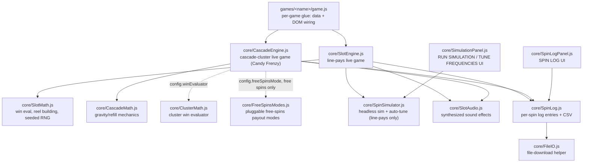
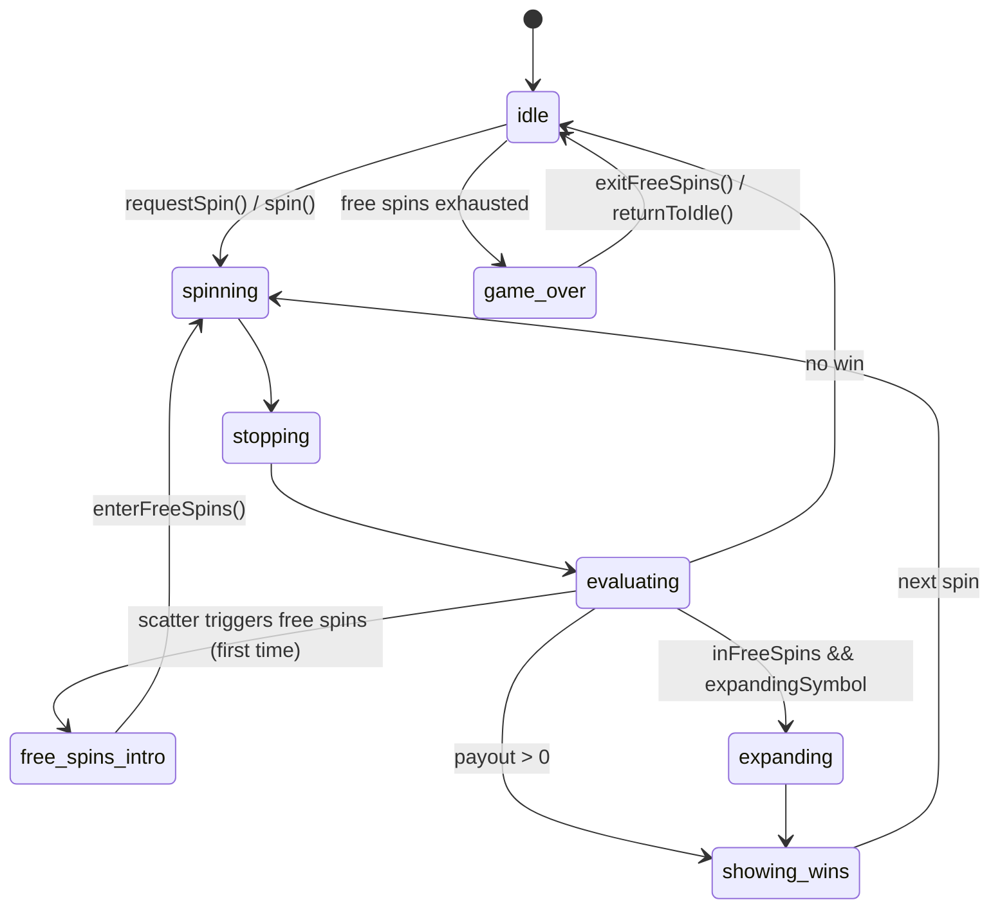
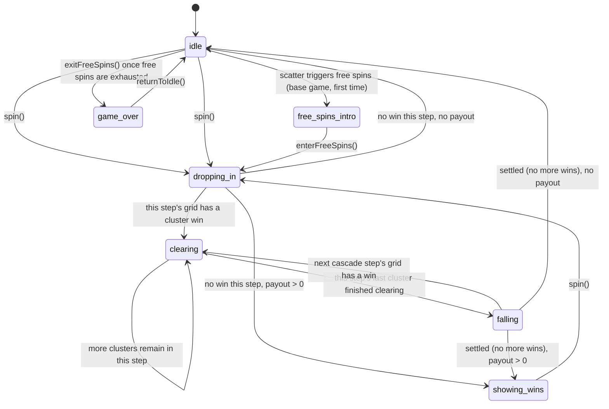
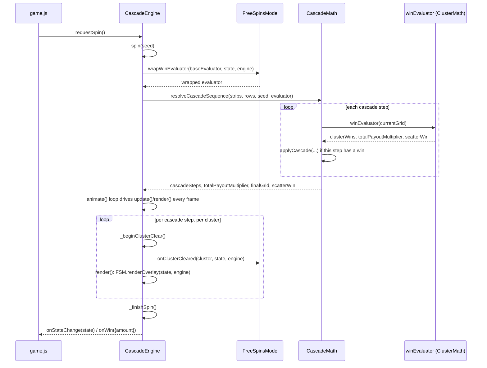

# Architecture

How `core/` is put together, the API each module exposes, and how a game in `games/<name>/`
plugs into it. See the top-level [README](../README.md) for how to run things and for the
reel-frequency-table data model specifically.

## Layering

Nothing in `core/` imports from `games/`. A game only ever flows data *into* `core/` (its own
paytable, paylines, reel strips, DOM element references) — `core/` never hardcodes a symbol
name, payout shape, or grid size. This is what lets `SlotMath.js` and `SpinSimulator.js` run
identically inside the live browser game, inside the in-browser debug tools, and inside
`node --test` with no DOM at all. `CascadeEngine.js`'s own math (`CascadeMath.js`/
`ClusterMath.js`) follows the same rule, though `SpinSimulator.js`/`SimulationPanel.js`
themselves are built around `SlotEngine.js`'s line-pays shape specifically and aren't used by
cascade games (see their own sections below).

## `core/SlotMath.js` — pure math, no side effects

Every export is a pure function: same inputs always produce the same output, nothing touches
the DOM, nothing holds state between calls. This is deliberate — it's what makes the module
usable from all three contexts above (game engine, simulator, tests) without adapters.

- **`checkWins(grid, paytable, paylines, activeLinesCount, wildSymbol, scatterSymbol,
  scatterTriggerCount)`** — the default win evaluator (`SlotEngine`'s `winEvaluator` default).
  Evaluates left-to-right line matches (with generic wild substitution via `wildSymbol`) and,
  separately, scatter wins (any symbol equal to `scatterSymbol`, anywhere on the grid, count
  ≥ `scatterTriggerCount`). Returns `{ lineWins, scatterWin, totalLinePayoutMultiplier,
  totalScatterPayoutMultiplier }`. `scatterWin.triggerFreeSpins` is set once enough scatters
  land, regardless of whether a payout is defined for that count.
- **`checkWildLineWins(grid, paytable, paylines, activeLinesCount)`** — an alternate line-win
  evaluator for wilds that only ever substitute in the *last* grid position of a line (e.g. a
  classic 3-reel fruit machine's reel-3 wild). Reads `wild`, `wildOnly`/`wildExcludes`,
  `wildPenalty`, and `aloneBonus` directly off each paytable entry — nothing hardcoded, so it's
  reusable by any game with this specific wild shape. Has no scatter handling at all.
- **`checkExpandingWins(grid, expandingSymbol, paytable, paylines, activeLinesCount,
  expandingPaytable)`** — Book-of-Dead-style expanding-symbol evaluator, called by
  `SlotEngine` itself (not chosen via `winEvaluator`) whenever `engine.inFreeSpins &&
  engine.expandingSymbol` is set after the normal win evaluation. Any reel containing the
  symbol counts as fully covered by it on every active payline.
- **`generateReel(reelWeights, targetLength, seed, exclude, defaultTriggerMinGap, paytable)`**
  — builds one weighted, seeded reel strip from a frequency table, with optional per-symbol
  `minGap`/`maxStack` spacing constraints. See the top-level README's "Reel frequency tables"
  section for the full shape and default-resolution rules.
- **`createSeededRng(seed)`** — deterministic PRNG (mulberry32); returns a `() => number`
  function yielding the same float sequence for a given seed every time. This is the seedable
  RNG threaded through everywhere an outcome needs to be reproducible: a live spin
  (`SlotEngine.spin(seed)`, so `engine.spin(engine.lastSpinSeed)` replays exactly), reel
  building, and the tuner's common-random-numbers search.
- **`generateTargetGrid(reelStrips, rowsCount, rng)`** — picks one random stop position per
  reel strip and reads off the visible window; this is what a spin outcome *is*, independent
  of animation. `SlotEngine.spin()` calls this once per spin with a fresh (or replayed) seeded
  rng to get `this.targetGrid`, which every reel's landing animation then just visually
  catches up to.

## `core/CascadeMath.js` / `core/ClusterMath.js` — cascade pure math

Same "pure function, no side effects" rule as `SlotMath.js` above - this is Candy Frenzy's
(and any future cascade-cluster game's) equivalent of that module, split in two: generic
cascade mechanics (`CascadeMath.js`, knows nothing about clusters or paylines) and this game's
own win evaluator (`ClusterMath.js`).

- **`nextStripSymbol(strip, cursorState)`** (`CascadeMath.js`) — reads the symbol at
  `cursorState.index`, advances the cursor by 1 (wrapping circularly), and never re-rolls -
  the one rule every cell dropping into the grid follows, whether that's the very first fill
  or a later cascade refill.
- **`applyCascade(grid, cursorStateByColumn, strips, clearedPositions)`** (`CascadeMath.js`) —
  removes the given positions, compacts each column's survivors downward (gravity), and
  refills the vacated top cells by reading forward from that column's own cursor. Returns
  `{ grid, fallOffsets }`, where `fallOffsets[col][row]` is that cell's fall distance in rows
  for animating the transition (a whole freshly-spawned group in one column shares the same
  offset, so it forms one contiguous block sitting just above the grid, never partway inside
  it). Also used for a spin's very first fill: call it with an all-null grid and every
  position listed as cleared.
- **`checkScatterCount(grid, scatterSymbol, triggerCount)`** (`CascadeMath.js`) — counts a
  symbol anywhere on the grid, independent of win type; a scatter check runs the same way
  whether the game underneath is cluster-pays or a future payline-cascade game.
- **`resolveCascadeSequence(strips, rowsCount, seed, winEvaluator, maxCascadeSteps=1000)`**
  (`CascadeMath.js`) — the "what happens" half of one entire spin: resolves the initial fill,
  then every cascade step, synchronously and deterministically, until a step produces no win.
  Returns `{ cascadeSteps, totalPayoutMultiplier, finalGrid, scatterWin }`, where each
  `cascadeSteps[i]` carries that step's `grid`/`fallOffsets`/`clusterWins`/`payout`. This
  mirrors `SlotEngine`'s own precompute-then-animate pattern (`generateTargetGrid` then a
  reel's landing tween) - `CascadeEngine`'s job is only to animate playback of an
  already-fully-resolved sequence, never to decide it live frame-by-frame.
- **`checkClusterWins(grid, paytable, minClusterSize, scatterSymbol, scatterTriggerCount)`**
  (`ClusterMath.js`) — Candy Frenzy's win evaluator: orthogonal flood-fill clustering (up/down/
  left/right, not diagonal) plus a cluster-size payout lookup off each symbol's
  `paytable[symbol].clusterPayout` (an array of `{ min, multiplier }` breakpoints - a cluster
  can run all the way up to the full grid, not a small fixed line-length like a payline game's
  `payout[i]` array). Returns `{ clusterWins, totalPayoutMultiplier, scatterWin }`, the exact
  shape `resolveCascadeSequence`'s `winEvaluator` parameter expects - a future cascade game
  with a different win rule (e.g. payline-based) would supply its own evaluator with this same
  shape instead, unchanged elsewhere.

## `core/SlotEngine.js` — the live game: state machine + canvas renderer

A class, one instance per running game (`new SlotEngine(canvas, config)`). Owns balance,
bet, reel physics/animation, and win presentation; delegates all win logic to whichever
`winEvaluator` function the config supplies.

**Construction config** (all optional except `reelStrips`, which must have one entry per
`reelsCount`):

| Field | Default | Purpose |
|---|---|---|
| `reelsCount`, `rowsCount` | `5`, `3` | Grid shape |
| `paytable` | `{}` | Passed straight through to `winEvaluator` |
| `reelStrips` | `[]` | One strip per reel, from `generateReel` |
| `paylines` | *(required, no default)* | One row-index-per-reel array per line |
| `wildSymbol`, `scatterSymbol` | `null` | Passed positionally to `winEvaluator` — only meaningful to evaluators that read them (`checkWins` does; `checkWildLineWins` ignores them, reading wild rules off `paytable` instead) |
| `winEvaluator` | `checkWins` | `(grid, paytable, paylines, activeLinesCount, wildSymbol, scatterSymbol) => results` |
| `betPerLine`, `linesCount` | `1`, `10` | Starting bet |
| `symbolsConfig`, `spritesheetUrl` | — | Sprite atlas: `{ [symbolName]: {x,y,w,h} }` + image URL |
| `onStateChange(state)` | no-op | Fired on every state transition (see State machine below) |
| `onScatterTrigger(scatterCount, isInFreeSpins)` | no-op | Fired instead of auto-advancing when `scatterWin.triggerFreeSpins` — the game decides what a trigger/retrigger means |
| `onWin({amount, isExpanding})` | no-op | Fired whenever a spin pays out |

**State machine** (`engine.state`, reported via `onStateChange`): `idle` → `spinning` →
`stopping` → `evaluating` → (`free_spins_intro` | `expanding` | `showing_wins` | `idle`) →
... → `game_over` (free spins summary). Every transition is an explicit assignment inside
`SlotEngine`, not inferred from animation progress — e.g. a reel's landing tween is scheduled
to finish at a precomputed timestamp (`landStartTime`), so "did it land" is never a question
answered by polling physics.

**Public methods a game calls:**
- `requestSpin()` — the one entry point for a UI's spin/stop button; safe to call in any
  state (queues itself if the engine is mid-animation, e.g. during an expansion).
- `spin(seed?)` / `stopSpin()` — start a spin (optionally replaying a specific seed) / cut the
  current spin short.
- `forceWinResult('scatter' | 'expanding' | 'bigwin')` — debug/cheat helper; forces the next
  spin's grid to contain a given outcome (see each game's README for its cheat buttons).
- `enterFreeSpinsIntro()` / `enterFreeSpins(spinsCount, expandingSymbol)` /
  `retriggerFreeSpins(spinsCount)` / `returnToIdle()` / `exitFreeSpins()` — free-spins
  lifecycle, entirely game-driven (see "Adding free spins" below) — `SlotEngine` never enters
  or exits free spins on its own.
- `updateBet()` — recompute `totalBet` after changing `betPerLine`/`linesCount`.
- `loadAssets(spritesheetUrl?, symbolsConfig?)` — (re)load the sprite atlas, e.g. for a theme
  switcher.
- `runSimulation(numBaseSpins?, betPerLine?, linesCount?, options?)` — thin wrapper around
  `SpinSimulator.simulateSpins` using this engine's own live `config`, so a simulation always
  measures exactly what the running game would actually pay. `options.seed` seeds the run for
  reproducibility; `options.logSpins` (default `false`) populates the returned `spinLog` (see
  "Spin logging" below) — both off by default, matching `simulateSpins`' own legacy behavior.

Also exposes `engine.spinLog` (one entry per real spin made so far, see "Spin logging" below)
and `engine.lastSpinSeed` (the seed behind the most recent spin — `engine.spin(engine.
lastSpinSeed)` replays it exactly) as plain properties a game or debug tool can read directly;
neither needs a method call.

Rendering (`render()` and everything below it) is internal — a game never calls into it
directly, only supplies the sprite atlas and reacts to `onStateChange`/`onWin` to update its
own DOM (balance display, spin button label, etc.).

## `core/CascadeEngine.js` — the cascade-cluster live game

`SlotEngine.js`'s sibling for cascade-cluster games (currently just Candy Frenzy, but nothing
about this class is Candy-Frenzy-specific) - same "one class instance, owns balance/bet/
animation, delegates win logic to config" shape, built around `resolveCascadeSequence`
(`CascadeMath.js`) instead of `generateTargetGrid`. `config.winEvaluator` here is a
single-argument closure the game supplies (e.g. `(grid) => checkClusterWins(grid, PAYTABLE, 5,
'bonus', 3)`) - `CascadeEngine` itself knows nothing about clusters or paylines, only about
grids, cascades, and free spins.

**Construction config** (all optional except `reelStrips`, `paytable`, `winEvaluator`):

| Field | Default | Purpose |
|---|---|---|
| `reelsCount`, `rowsCount` | `7`, `7` | Grid shape |
| `paytable`, `reelStrips` | `{}`, `[]` | Passed straight through to `winEvaluator` / `resolveCascadeSequence` |
| `winEvaluator` | no-op (no wins) | `(grid) => { clusterWins, totalPayoutMultiplier, scatterWin }` |
| `scatterSymbol` | `null` | Which symbol name triggers free spins |
| `freeSpinsMode` | `createFlatMultiplierMode()` | Pluggable free-spins payout mode - see `core/FreeSpinsModes.js` below |
| `betAmount` | `1` | This game's single flat bet (no bet-per-line/lines concept) |
| `symbolsConfig`, `spritesheetUrl` | — | Sprite atlas, same shape as `SlotEngine`'s |
| `onStateChange(state)` | no-op | Fired on every state transition |
| `onScatterTrigger(scatterCount, isInFreeSpins)` | no-op | Fired instead of auto-advancing when the resolved spin's `scatterWin.triggerFreeSpins` is set |
| `onWin({amount})` | no-op | Fired whenever a spin pays out |

**State machine** (`engine.state`): `idle` → `dropping_in` → (`clearing` → `falling`)* →
`showing_wins` → `idle`, plus `free_spins_intro`/`game_over` (free-spins lifecycle, same
naming convention as `SlotEngine.state`).

Each reel/column animates independently rather than behind one global barrier: a column's own
leftover grid exits, then that same column's new symbols enter immediately
(`columnOutgoingDone`/`columnEnterStartTime`), staggered left-to-right on an ease-out curve
(`_columnStartDelay`) so it reads as a wave rather than a
uniform drop. Within one spin, multiple cascade steps' clusters animate one at a time
(`currentClusterWins`/`currentClusterIndex`/`_beginClusterClear`), each with its own glow,
per-symbol vanish variant, particles, floating win popup, and ding - not all bursting at once.

**Public methods a game calls:**
- `requestSpin()` / `spin(seed?)` — same shape as `SlotEngine`'s; `spin()` also handles the
  every-spin "leftover grid falls out, new grid falls in" animation and (on the very first
  call) the decorative non-winning initial fill (`_fillInitialGrid`, called once from `init()`
  so the grid is never blank on load).
- `forceScatterResult()` — debug/cheat helper; forces the next spin's final grid to contain 3
  of `config.scatterSymbol`, for testing the free-spins trigger without waiting for a natural
  hit.
- `enterFreeSpinsIntro()` / `enterFreeSpins(spinsCount)` / `retriggerFreeSpins(spinsCount)` /
  `returnToIdle()` / `exitFreeSpins()` — free-spins lifecycle, entirely game-driven, same
  division of responsibility as `SlotEngine`'s (see "Optional: free spins" below - the cascade
  version follows the same pattern). `enterFreeSpins`/`exitFreeSpins` also rebuild the active
  `freeSpinsMode`'s state fresh (see `core/FreeSpinsModes.js`), so a mode's own per-tile
  tracking never leaks between bonus rounds or into the base game.
- `handleAutoPlay()` — schedules the next spin (base-game autoplay or the free-spins loop)
  after the current one settles.

Also exposes `engine.spinLog`/`engine.lastSpinSeed` as plain properties, same as `SlotEngine`.
No `runSimulation()`/RUN SIMULATION/TUNE FREQUENCIES support - `SpinSimulator.js` is built
around `SlotEngine`'s line-pays shape specifically; a cascade-aware equivalent would be a
separate future project (see Candy Frenzy's own README).

One spin, end to end - resolving the whole outcome synchronously, then animating playback of
it (`freeSpinsMode` only enters the picture while `inFreeSpins`):

## `core/FreeSpinsModes.js` — pluggable free-spins payout modes

How `CascadeEngine` varies what a free-spins win pays, without hardcoding any one rule into
the engine itself: `config.freeSpinsMode` is a plain object of lifecycle hooks the engine
calls without knowing which concrete mode is active, only ever consulted while
`engine.inFreeSpins` (the base game always uses `winEvaluator` completely unwrapped). A future
mode - for Candy Frenzy or a future cascade game - just needs to implement this same shape, no
`CascadeEngine` changes required.

- **`createState(engine) -> any`** — builds the mode's own working state. Called once when
  free spins begin (`enterFreeSpins`) and again the instant they end (`exitFreeSpins`), so
  persistent per-tile state (like multiplier tiles) always starts fresh at the top of a bonus
  round and is fully cleared the moment it's over.
- **`wrapWinEvaluator(baseEvaluator, state, engine) -> (grid) => results`** — wraps the game's
  win evaluator so every cluster's payout (and the step's `totalPayoutMultiplier`) already
  reflects this mode's bonus by the time `resolveCascadeSequence` finishes resolving the whole
  spin, synchronously, one call per cascade step, in chronological order. `CascadeEngine`'s own
  money code (`_finishSpin`/`_spawnClusterWinPopups`/spin log) trusts these numbers as-is and
  never applies anything else on top.
- **`onClusterCleared(cluster, state, engine)`** — called once per cluster, only while
  `inFreeSpins`, at the exact moment `_beginClusterClear` starts playing that cluster's own
  clear animation - a mode with visible per-tile state updates it here, in step with the
  animation, not all at once back when the whole spin was precomputed.
- **`renderOverlay(state, engine)`** — called once per frame from `render()`, every frame
  regardless of `inFreeSpins` (a mode's state is reset to "nothing to show" the instant free
  spins end, so this is naturally a no-op outside a bonus round). Whether it draws before or
  after the grid's own symbols that frame is controlled by the mode object's own
  **`renderOverlayOrder`** property (`'behind'` or `'front'`, default `'front'` if omitted) -
  candy sprite art is essentially opaque, so a `'behind'` overlay is only ever visible on a
  cell with no symbol drawn over it yet; `'front'` stays legible on a landed tile too. Each
  mode picks whichever fits its own visual.

Two modes ship today:
- **`createFlatMultiplierMode(multiplier = 2)`** — `CascadeEngine`'s own default: every
  free-spins win simply pays `multiplier`x. No per-tile state, no visual overlay.
- **`createMultiplierTilesMode({ badgeStyle = 'background', renderOrder = 'front' })`** —
  Candy Frenzy's main free-spins mode: every tile a winning cluster occupies gets (or doubles)
  a persistent multiplier (untouched = 1x, never drawn; first win = 2x; each subsequent win
  there doubles it again). A later cluster overlapping one or more marked tiles has their
  values summed and applied to its own payout. `badgeStyle` picks `'background'` (a big
  translucent tint + number filling the cell) or `'corner'` (a small solid chip) for how a
  marked tile's multiplier is drawn; see Candy Frenzy's own README for which it currently uses
  and why.

## `core/SpinSimulator.js` — headless simulation and auto-tuning

Also pure/side-effect-free (no DOM), built on top of `SlotMath.js`'s same evaluators — a
simulated RTP is never a separate model of the game, it's the same `checkWins`/
`checkWildLineWins`/`generateReel` a live spin uses, just run in a loop.

- **`simulateSpins(config, numBaseSpins, betPerLine, linesCount, rng)`** — runs
  `numBaseSpins` spins (plus any triggered free-spin rounds) through `config.winEvaluator`
  (defaulting to `checkWins`) and returns aggregate stats: `rtp`, `maxWin`, win/hit
  distributions, `freeSpinsTriggered`, etc. `config` is shaped like `SlotEngine`'s own config
  (`reelStrips`, `paytable`, `paylines`, `winEvaluator`, ...) — in fact `SlotEngine.
  runSimulation()` passes its own `this.config` straight through. Two config fields are opt-in,
  both `false` by default so existing callers see no behavior change: `hasExpandingWild`
  (simulate a Book-of-Dead-style expanding-wild bonus during free spins — only bookbookbook
  actually has this mechanic) and `logSpins` (populate `results.spinLog`, one entry per
  simulated spin, via `core/SpinLog.js` — see "Spin logging" below).
- **`tuneFrequencies(paytable, reelFrequencyTables, options)`** — the RUN SIMULATION/TUNE
  FREQUENCIES panel's auto-balancer. Given a paytable and one frequency table per reel,
  searches for reel frequencies that hit a target RTP and free-spins trigger rate, returning a
  tuned clone (never mutates its input). See its own extensive JSDoc in the file for the full
  two-phase strategy (trigger-rate scaling, then a joint Nelder-Mead search over per-symbol
  weights) and every tuning knob (`orderingBiasByReel`, `limitPenaltyWeight`,
  `uniformityPenaltyWeight`, `initialWeightStrategy`, `minFrequency`/`maxFrequency`, `fixed`,
  ...) — that doc is deliberately the canonical reference, not duplicated here.
- **`gradientDescent1D`**, **`nelderMead`** — generic numerical optimizers `tuneFrequencies`
  is built from (log-space 1D search and an N-dimensional simplex search, respectively). Not
  slot-specific; exported mainly because `tuneFrequencies`' own tests exercise them directly.

## `core/SimulationPanel.js` — browser UI for the simulator

The DOM/rendering glue between a game's RUN SIMULATION / TUNE FREQUENCIES buttons and
`SpinSimulator.js`'s pure functions. A game never talks to `SpinSimulator.js` directly for its
UI — it calls these instead:

- **`runSimulationAndRender({ engine, paytable, betPerLine, linesCount, numSpins, domRefs
  })`** — runs `engine.runSimulation(...)` and renders RTP/win-distribution/per-symbol
  breakdown tables into the given modal DOM elements.
- **`openTuneFrequenciesPanel({ paytable, reelFrequencyTables, tuneConfig, domRefs })`** —
  opens the tuner UI (target RTP/trigger-rate inputs, per-reel ordering-bias dropdowns,
  live iteration progress), runs `tuneFrequencies`, and renders a diff plus a
  copy-pasteable result via `formatReelFrequencyTablesForCopy`. Never mutates the game's
  live reel tables itself — applying a tuned result means pasting it back into `game.js` and
  reloading, a deliberate, explicit source change rather than a silent runtime patch.
- **`formatReelFrequencyTablesForCopy(reelFrequencyTables)`** — renders an array of
  `{ defaults, symbols }` tables back into pasteable `export const FREQUENCY_REELn = {...}`
  source text (4-significant-figure frequencies, so values under 1 don't collapse into each
  other — see the top-level README).

## `core/SpinLog.js` / `core/SpinLogPanel.js` / `core/FileIO.js` — spin logging

Both `SlotEngine.js` (live spins) and `SpinSimulator.js` (a batch run, opt-in via
`config.logSpins`) build their per-spin log entries through the same pure functions in
`core/SpinLog.js`, so the two can't drift apart on field names or payout math:

- **`createSpinLogEntry({ spinIndex, phase, betPerLine, linesCount, chargedBet,
  scatterBetBase, winData, scatterSymbol, seed, timestamp })`** — builds one entry from a win
  evaluator's result. `seed`/`timestamp` are per-entry only when the caller has one (live play
  always does; a batch run shares one continuous rng stream across the whole call instead, so
  it leaves these `null` and documents the run's seed/start time separately — see
  `exportSpinLogCsv` below).
- **`applyExpandingWinToSpinLogEntry(entry, { expandingSymbol, expandingReels, expandingWin })`**
  — mutates an entry once its expanding win is known, whether that's immediately (a batch run
  already has it) or later (live play, only after the expansion animation finishes — see
  `SlotEngine._pushSpinLogEntry`/the `'expanding'` state handling in `update()`).
- **`summarizeSpinWins(entry)`** / **`exportSpinLogCsv(spinLog, { seed, startedAt,
  filenamePrefix })`** — the compact `TYPE:symbol:count:amount[:flags]` win-summary format (see
  its own doc for the exact grammar and a ready-made parsing regex) and the CSV builder +
  download trigger used by both the RUN SIMULATION panel's export button and
  `SpinLogPanel.js`'s.
- **`core/SpinLogPanel.js`'s `openSpinLogPanel({ engine, domRefs })`** — the SPIN LOG dev
  button's panel: a live-refreshing table of `engine.spinLog`'s most recent entries plus an
  export button. Reuses the same shared modal DOM as `SimulationPanel.js`'s panels.
- **`core/FileIO.js`'s `downloadTextFile(filename, text, mimeType)`** — generic
  browser-download utility `exportSpinLogCsv` is built on; not spin-log-specific.

## `core/SlotAudio.js` — synthesized sound effects

A singleton (`export const audio = new SlotAudio()`), imported and used directly by
`SlotEngine.js` — a game doesn't call it for gameplay sounds, only for `toggleMute()`/UI wiring
(mute button) and, in bookbookbook's case, `playScatterTrigger()` at custom points in its own
free-spins-intro flow. Every sound is a small Web Audio oscillator patch built at call time
(no audio asset files) — `playSpin`, `playReelStop(reelIndex)`, `playWin(payoutMultiplier)`,
`playScatterTrigger`, `playExpand`, `startBGM`/`stopBGM` (free-spins background loop),
`toggleMute`/`setMute`.

## Hooking up a new game

A game is a folder `games/<name>/` with three files, wired together by convention rather than
a plugin registry — there's no central list of games to update.

This section covers a line-pays game (`SlotEngine`) specifically. A cascade-cluster game
follows the same three-file convention but plugs into `CascadeEngine`/`CascadeMath.js`/
`ClusterMath.js`/`FreeSpinsModes.js` instead (see their sections above) - Candy Frenzy's own
README is the worked example, not duplicated here.

### 1. `game.js` — data + engine instantiation

1. Define the shared constants every other piece needs (`REELS_COUNT`, `ROWS_COUNT`,
   `REEL_LENGTH`, `REEL_SEEDS`, `BET_PER_LINE`, `LINES_COUNT`) — export them so `PAYLINES`
   sizing and later `tuneConfig` can't drift from what the live engine actually uses.
2. Define `PAYLINES` (see `SlotMath.js`'s payline shape above) and `PAYTABLE` (see the
   top-level README for the full field list: `payout`, `type`, `paymode`, `wild`,
   `wildOnly`/`wildExcludes`, `wildPenalty`, `aloneBonus`, `triggerFreeSpins`,
   `friendlyName`).
3. Define one `FREQUENCY_REELn` per reel and build `REEL_STRIPS` by mapping each through
   `generateReel(freqTable, REEL_LENGTH, seed, exclude, defaultTriggerMinGap, PAYTABLE)` — pass
   `PAYTABLE` explicitly as the 6th argument (per-reel tables don't carry `triggerFreeSpins`
   themselves).
4. Pick a `winEvaluator`: `checkWins` (the default — supports a positional `wildSymbol` and
   `scatterSymbol`) or `checkWildLineWins` (last-position-only wilds, all wild behavior read
   from `paytable`) from `SlotMath.js`, or a game-specific one with the same
   `(grid, paytable, paylines, activeLinesCount, ...)` shape.
5. On `window load`, build `symbolsConfig`/`spritesheetUrl` (see Asset loading below), then
   `new SlotEngine(canvas, { reelsCount, rowsCount, paytable, reelStrips, paylines,
   winEvaluator, wildSymbol, scatterSymbol, betPerLine, linesCount, symbolsConfig,
   spritesheetUrl, onStateChange, onScatterTrigger, onWin })`.
6. Wire the rest of the page's DOM controls (spin/auto/turbo/mute/bet/lines buttons) to the
   engine's public methods, the RUN SIMULATION / TUNE FREQUENCIES buttons to
   `runSimulationAndRender`/`openTuneFrequenciesPanel` from `SimulationPanel.js` (passing the
   same `PAYTABLE`/`FREQUENCY_REELn`/`PAYLINES` the live engine uses), and a SPIN LOG button to
   `openSpinLogPanel({ engine, domRefs: { simModal, simStats } })` from `SpinLogPanel.js`.

### 2. `index.html` — the DOM contract `game.js` expects

There's no framework here — `game.js` looks up elements by hardcoded `id`, so the HTML has to
supply them. At minimum: `#game-canvas` (the render target), `#btn-spin`, `#btn-auto`,
`#btn-turbo`, `#btn-mute`, bet/lines adjuster buttons and value spans, `#game-ticker`, a
`#modal-paytable` with a `#paytable-grid-content` container `game.js` fills in dynamically
(never hand-author paytable text — it drifts), and a `#sim-modal` with the stat elements
`runSimulationAndRender`/`openTuneFrequenciesPanel` render into (`#sim-stats`, `#sim-rtp`,
`#sim-total-spins`, `#sim-max-win`, `#sim-free-spins`, plus `#btn-sim`/`#btn-tune`/
`#btn-close-sim`/`#btn-spinlog` — `SpinLogPanel.js`'s panel reuses the same `#sim-modal`).
Copy an existing game's `index.html` as the starting point rather than writing this from
scratch — the exact id set is easiest to get right by example.

### 3. Asset loading

`game.js` fetches `./assets/<themeName>/<themeName>.tiles.json` (a `{ sheet, tiles: [{name,
x, y, w, h}] }` sprite atlas manifest) and builds `symbolsConfig`/`spritesheetUrl` from it —
one sprite sheet, one JSON manifest per theme, symbol names in the manifest must match the
paytable's own symbol keys.

### Optional: free spins / expanding symbol

`SlotEngine` provides the mechanism but not the policy — it never decides on its own what a
scatter trigger means. To add a free-spins bonus (as bookbookbook does):

1. Set `scatterSymbol` in the engine config and mark the trigger symbol
   `triggerFreeSpins: true` in `PAYTABLE` (drives both `checkWins`'s `scatterWin.
   triggerFreeSpins` and `generateReel`'s default spacing — see the top-level README).
2. Handle `onScatterTrigger(scatterCount, isInFreeSpins)`: decide what counts as an initial
   trigger vs. a retrigger (bookbookbook: 3+ to start, 2+ during free spins to add spins), and
   call `engine.enterFreeSpinsIntro()` for the intro animation state.
3. Once the player/animation is ready, call `engine.enterFreeSpins(spinsCount,
   expandingSymbol)` — this sets `engine.inFreeSpins`/`expandingSymbol` and starts the bonus
   spins loop. A retrigger just calls `engine.retriggerFreeSpins(spinsCount)`.
4. While `engine.inFreeSpins && engine.expandingSymbol` is set, every spin's normal win
   evaluation is automatically followed by `checkExpandingWins` inside `evaluateSpinResult()`
   — nothing extra to call for that part.
5. On the bonus's last spin, the engine transitions to `game_over`; handle that in
   `onStateChange` to show a summary and eventually call `engine.exitFreeSpins()` /
   `engine.returnToIdle()` to resume normal play.

## Design principles

- **Pure math, stateful engine, no DOM in between.** `SlotMath.js` has zero dependencies —
  not even on `SlotEngine.js`. This is why `SpinSimulator.js` can run a million spins in
  Node with no browser, and why `tests/*.mjs` can test win logic and reel building directly
  without ever constructing a `SlotEngine` or touching a canvas.
- **One source of truth per game, shared by three consumers.** A game's `PAYTABLE`,
  `PAYLINES`, and `FREQUENCY_REELn` tables are defined once in `game.js` and passed
  unchanged into the live `SlotEngine`, into `RUN SIMULATION` (`simulateSpins`), and into
  `TUNE FREQUENCIES` (`tuneFrequencies`). There is no separate "simulation config" to keep in
  sync — the debug tools can't silently drift from what the live game actually pays out
  because they're never given the chance to hold their own copy.
- **Nothing in `core/` hardcodes a symbol name, grid size, or paytable shape.** Every
  behavior (wild rules, scatter/trigger detection, expanding symbol, ordering preferences) is
  read from the `paytable`/config a game supplies. `checkWildLineWins`, for instance, works
  for any wild-in-last-position paytable, not just fruitmachine's specific one.
  `generateReel`'s `minGap`/`maxStack`/`triggerFreeSpins` logic is entirely data-driven off
  the reel table and paytable passed in.
- **Deterministic, seedable randomness everywhere an outcome matters.** `createSeededRng`
  is the one RNG primitive threaded through reel building, live spins (so
  `engine.spin(engine.lastSpinSeed)` replays exactly), and the tuner's optimization search
  (common random numbers, so consecutive candidate evaluations are comparable instead of
  independently noisy). Only cosmetic randomness (which decorative symbol flickers past while
  spinning, particle effect angles) uses plain `Math.random()`.
- **A state machine, not ad hoc flags.** `SlotEngine.state` is a single explicit field with a
  fixed set of values and every transition assigned at a specific point in the code (see the
  State machine table above) — not inferred from polling animation progress. Animation tweens
  are scheduled against precomputed timestamps instead, so "is it done" is answered by
  arithmetic, never by a race between rendering and game logic.
- **Best-effort, never-throw constraint solving.** `generateReel`'s `minGap`/`maxStack`
  repair passes and `tuneFrequencies`' soft ordering/min/max penalties all degrade gracefully
  when a constraint can't be fully satisfied (a too-dense reel, a genuinely conflicting
  target) rather than throwing or looping forever — a bad frequency table produces a
  best-effort reel or a logged violation, not a crash.
- **Debug tooling calls the same code path as the live game, not a re-implementation.**
  `RUN SIMULATION` runs through `engine.runSimulation()` → `simulateSpins(this.config, ...)`
  — literally the running engine's own config object. `TUNE FREQUENCIES` builds trial reels
  with the same `generateReel` and scores them with the same `winEvaluator` the live game
  uses. A simulated RTP is only ever trustworthy because of this — see the earlier
  `.toFixed(1)` frequency-rounding bug (documented in git history) for what happens when a
  *presentation-layer* formatter, not the math itself, silently diverges from the real values.

---
_Docs last synced with the codebase: 2026-07-26, commit `59d9969`._
