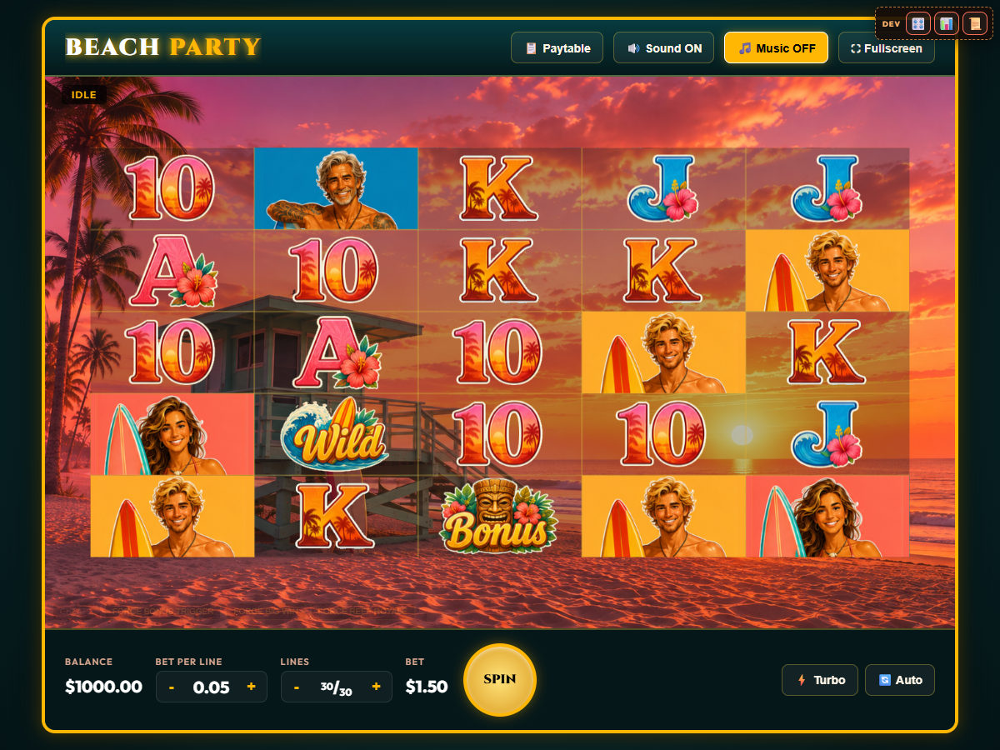

# Beach Party (beachparty)

A 5-reel, 5-row, 30-line reel game (`LineMechanic` + `ReelScrollAnimator`) with wide 256×128 tile
art and tall multi-row "stacked" surfer symbols - two features that don't exist anywhere else in
the codebase yet. Template: lemonpop for init/reel scaffolding, barfruits for winline mechanics.

See the top-level [README](../../README.md) for how reel frequency tables, `minGap`/
`maxStack`, and `tuneFrequencies` work in general, and [docs/DESIGN.md](docs/DESIGN.md) for the
full original design write-up; this file only covers what's specific to this game.

## Paylines

30 lines across the new 5x5 grid template (`PAYLINES` in `game.js`, documented in
`docs/PAYLINES-TEMPLATES.md`'s "5x5 playfield" section): 5 straight rows, 2 diagonals, V/
inverted-V at three depths, step down/up, U-shapes at three depths, zigzags at three row-pairs,
and W/M shapes at three spreads.

## Symbols and paytable

Only 3, 4, or 5 of a kind pay (nothing on 1 or 2), left-to-right from reel 1:

| Symbol | Type | 3 | 4 | 5 |
|---|---|---|---|---|
| Wild Surfer | wild | 25x | 100x | 400x |
| Big Kahuna (blue surfer) | premium | 20x | 60x | 250x |
| Wave Shredder (green surfer) | premium | 15x | 45x | 180x |
| Coral Rider (pink surfer) | premium | 10x | 30x | 120x |
| Sunny Grom (yellow surfer) | premium | 8x | 25x | 100x |
| Ace | regular | 6x | 20x | 60x |
| King | regular | 5x | 16x | 50x |
| Queen | regular | 4x | 14x | 40x |
| Jack | regular | 4x | 12x | 35x |
| Ten | regular | 3x | 10x | 30x |
| Beach Bonus | trigger only | - | - | - |

Surf-culture nicknames replace plain color labels for the four surfer symbols, ranked loosely by
skill/status to match payout tier (Kahuna > Shredder > Rider > Grom).

## Stacked symbols

Each surfer color also has 5 tall "stack" variant tiles (`surfer_<color>_1..5`,
`STACKED_SYMBOLS` in `game.js`) used purely for rendering
(`core/rendering/StackedSymbols.js`/`SlotRenderer.drawReelsSymbols`): whenever a reel's entire
column lands on the same surfer color, the renderer draws the tall stacked art instead of five
separate tiles. A stacked run still pays as ordinary N-of-a-kind on the base symbol - identical
math to an unstacked run, this is a rendering-only feature. Reels use `minStack: 2, maxStack: 5,
stackChance: 0.45` for each surfer color, so a little under half of their occurrences become a
2-5 tall cluster.

## Beach Bonus (free spins) and Reef Royale

`bonus` only appears on reels 1, 3, and 5 (`BONUS_REEL_INDEXES`, zeroed out on reels 2/4).
Landing it on all three in the same spin (`detectBonusTrigger`) awards 8 free spins
(`BONUS_SPINS_AWARD`); landing it on all three again during the bonus retriggers +8 more,
uncapped - same shape as barfruits' scatter/retrigger, but restricted to those three reels
instead of "anywhere on the grid."

Two rules apply only while `engine.inFreeSpins` (`evaluateBeachPartyWin` in `game.js`, wrapping
`checkWins`):

- **Stacked wilds** - a reel that lands a full 5-tall stack of one surfer color counts as wild
  for line-matching (the win-evaluation grid is copied for this; the grid used for rendering is
  untouched, so the surfer art keeps showing instead of a wild icon).
- **Reef Royale mini jackpot** - collecting full 5-tall stacks of all 4 distinct surfer colors on
  the board at once (needs at least 4 of the 5 reels fully stacked, one per color) pays a flat
  `JACKPOT_MULTIPLIER` (250x total bet) on top of the already wild-heavy line win from the rule
  above, with its own "REEF ROYALE JACKPOT!" ticker message instead of the usual win amount.

Beach Bonus swaps both the viewport background (`boards_on_the_beach.png` instead of the base
game's `beach_lifeguard_hut_2.png`) and the music track (`pixel_drift.mp3` instead of
`pacific_drift_theme.mp3`) for the duration of the round - see "Per-state assets" below.

## Reels

`REELS_COUNT = 5`, `ROWS_COUNT = 5`. `wild` uses `minGap: 4`, matching barfruits' scatter-spacing
pattern. All five `FREQUENCY_REEL`s start from the same table (`FREQUENCIES` in `game.js`),
differentiated per reel only by zeroing `bonus` on reels 2 and 4.

## Betting

Per-line bet: `$0.05` default and step, up to `$5` max. Lines: 1-30, adjustable independently of
bet size (same pattern as barfruits); total bet is always `betPerLine × linesCount`.

## Non-square, wide tiles

Symbol art is 256x128 (2:1 aspect ratio) instead of every other game's square tiles -
`symbolAspectRatio: 2` in the engine config, which `core/rendering/GridLayout.js` and
`CoreSlotEngine.resize()` use to fit wide cells instead of assuming width equals height. This is
the first game in the codebase to use non-square symbols.

## Per-state assets (manifest-key driven)

`viewportBackground`, `freeSpinsViewportBackground`, and `music` all reference
`GAME_ASSET_MANIFEST` keys (`viewportBackground`, `freeSpinsViewportBackground`, `music`,
`musicFreeSpins`) rather than literal file paths - `CoreSlotEngine`/`SlotRenderer` resolve those
keys against the loaded asset map once `loadAssets()` finishes, so every file goes through
`AssetLoader`'s own URL resolution and preloading (needed for this app's file:// / VS Code
webview environment) instead of a raw string handed straight to `new Image()`/`new Audio()`.

## Playfield theme

Beach Party leans on its own photo backgrounds rather than a themed cabinet: `playfield.frame`
and `playfield.outline` are both `'transparent'` (no border/glow around the reels), and
`playfield.reelsBackground` is a much lighter teal tint (`rgba(4, 20, 22, 0.28)`) than every
other game's default near-black wash, so the beach art stays visible behind the symbols. The
win-highlight box drawn around winning cells during `showing_wins` is also flush with the cell
edge (`winHighlightInset: 0`) instead of every other game's 4px inset. All four are opt-in
`CoreSlotEngine`/`SlotRenderer` config fields that default to the old behavior for every other
game.

## Controls

Same as barfruits (SPIN/STOP, AUTO, TURBO, mute, PAYTABLE modal), plus a Music mute toggle, a
free spins panel, and trigger/summary modals for the Beach Bonus round.

## Debug tools

**RUN SIMULATION** and **TUNE FREQUENCIES** work the same as the other games (base-game economics
only - see the top-level README's note on `winEvaluator` not being passed to `tuneConfig`).
**SPIN LOG** opens a live table of recent real spins with a CSV export button. `game.js` has a
`DEBUG_MODE` flag (on by default) with three cheat buttons: force a Beach Bonus trigger, force a
line big win, or force a Reef Royale jackpot (only actually pays out while a Beach Bonus round is
active - trigger the bonus first). The jackpot cheat uses a generic core hook
(`CoreSlotEngine._buildForcedGrid`'s `'stackedJackpot'` branch) that fills one reel per distinct
`stackedSymbols` entry with a full-height stack, usable by any future game with stacked symbols.

## Tuning status

The frequencies in `FREQUENCIES` are a plain, untuned baseline - they have **not** been through a
TUNE FREQUENCIES pass yet, since that requires the in-browser panel. `tests/beachparty.test.mjs`
only checks that the math wiring itself is sane (consistent shapes, the bonus symbol's reel
restriction, stacked-symbol tile references, a finite RTP), not that RTP is anywhere near a
target - run TUNE FREQUENCIES in-browser before treating this paytable as final.

---
_Last updated: 2026-08-03, commit `941692c`._
